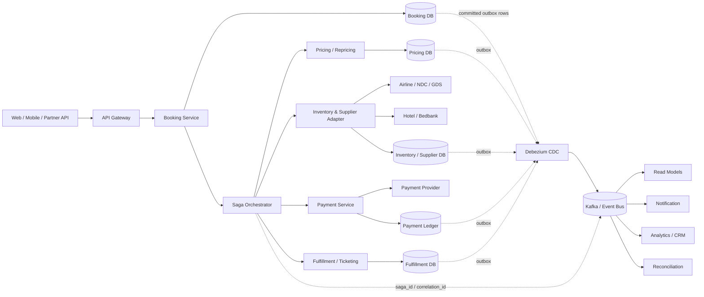
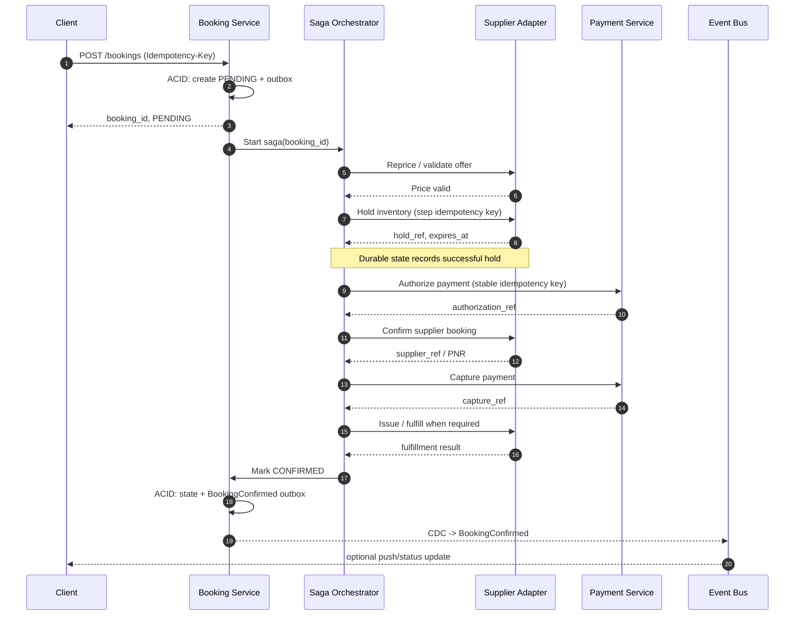
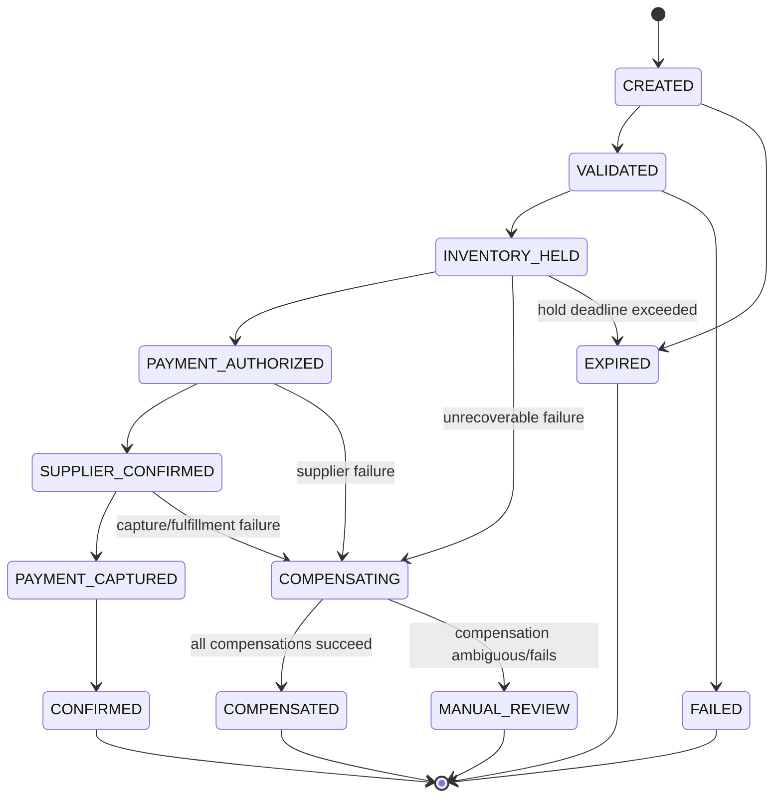

# Saga và Transactional Outbox cho luồng đặt chỗ OTA lưu lượng cao

## Tóm tắt điều hành

Đối với một OTA có lưu lượng cao, nơi một booking có thể đi qua pricing, inventory, airline/hotel supplier, payment, ticketing/fulfillment và notification, **không nên cố tạo ảo giác rằng toàn bộ quy trình là một ACID transaction duy nhất**. Saga nguyên thủy của Garcia-Molina và Salem được thiết kế chính xác cho long-lived transactions: chia giao dịch dài thành các local transaction có thể interleave; nếu toàn bộ chuỗi không hoàn tất, hệ thống chạy các transaction bù trừ để sửa phần đã thực hiện. Đáng chú ý, bài báo Saga năm 1987 đã dùng **airline reservation** làm ví dụ miền nghiệp vụ. citeturn21search0turn23view0

Kiến trúc tôi khuyến nghị cho core booking flow là:

**Orchestrated Saga + Transactional Outbox/CDC + at-least-once messaging + end-to-end idempotency + consumer inbox/deduplication + reconciliation.**

Transactional Outbox giải quyết bài toán dual-write: trạng thái booking và bản ghi event được ghi trong **cùng local database transaction**, sau đó CDC như Debezium chuyển outbox sang broker. Như vậy không còn cửa sổ “DB commit nhưng publish mất” hoặc “publish thành công nhưng DB rollback” của cách ghi DB rồi trực tiếp publish. AWS và Debezium đều mô tả outbox theo đúng mục tiêu này. citeturn18search4turn18search1turn18search25

Tôi **không khuyến nghị đặt mục tiêu “exactly-once end-to-end”** qua database → broker → nhiều microservice → payment gateway → airline/GDS/hotel supplier. Kafka có idempotent producer và exactly-once processing trong các phạm vi được Kafka hỗ trợ, nhưng tài liệu Kafka cũng lưu ý rằng các tuyên bố “exactly once” phải được hiểu đúng phạm vi giữa publish và consume. Một API bên ngoài hoặc database ngoài Kafka không tự nhiên được bao phủ bởi Kafka transaction. citeturn18search14turn18search22 Thực tế kiến trúc nên đạt **effectively-once business effect**: delivery có thể at-least-once, nhưng mọi side effect quan trọng được bảo vệ bằng idempotency key, unique constraint, inbox/dedup và reconciliation. Stripe cũng thiết kế idempotency key để client retry request an toàn khi gặp network failure. citeturn24search0turn24search8

Với core booking, tôi ưu tiên **orchestration** hơn choreography. Choreography phù hợp cho ít participant và các event hậu xử lý ít phụ thuộc nhau; orchestration làm explicit workflow state, timeout, retry, compensation và audit, do đó phù hợp hơn với booking có nhiều remote supplier và các trạng thái bất định. AWS phân biệt choreography dựa trên event subscription với orchestration dựa trên coordinator trung tâm. citeturn18search0turn18search8 Airbnb cũng mô tả việc xây durable workflow engine cho các workflow quan trọng như payment nhằm tránh business process bị phân mảnh thành các queue handler rời rạc; kinh nghiệm của họ nhấn mạnh durable checkpointing, compensation, idempotency và workflow evolution. citeturn19search2

Một nguyên tắc đặc biệt quan trọng trong OTA là **compensation không có nghĩa “rollback database về byte-for-byte như cũ”**. Sau khi seat/hotel room đã bị giữ, payment đã authorize, vé đã issue hoặc supplier cancellation fee đã phát sinh, thế giới bên ngoài đã thay đổi. Compensating transaction phải tạo một trạng thái nghiệp vụ mới hợp lệ, và đôi khi forward recovery hoặc manual intervention tốt hơn rollback. Microsoft minh họa chính điều này bằng travel booking: hotel fail không nhất thiết phải tự động hủy mọi flight; có thể tìm hotel khác hoặc yêu cầu khách lựa chọn. citeturn18search7

**Baseline kiến trúc khi stack chưa được xác định:** PostgreSQL cho booking/payment domain state; Debezium CDC; Kafka hoặc managed Kafka cho event backbone; Schema Registry với Avro/Protobuf; Temporal cho code-first orchestration, hoặc Camunda 8 nếu BPMN/business visibility là yêu cầu mạnh, hoặc AWS Step Functions nếu workload chủ yếu trên AWS và chấp nhận coupling với cloud provider. Temporal duy trì workflow state qua durable event history; Camunda Zeebe persist workflow execution state theo partition; Step Functions Standard hỗ trợ long-running auditable workflow và có execution model khác với Express. citeturn20search0turn19search3turn19search1

Vì traffic, SLO và supplier mix chưa được cung cấp, báo cáo **không gán TPS, p99 hay timeout tùy ý**. Những giá trị đó phải được suy ra từ peak demand, supplier SLA, booking abandonment curve, payment authorization TTL, inventory hold TTL và load/chaos tests. Temporal cũng khuyến nghị capacity decision phải dựa trên testing at scale thay vì giả định. citeturn20search21

## Nền tảng và khung ra quyết định kiến trúc

**Saga** là một chuỗi local transactions; mỗi bước commit độc lập tại service sở hữu dữ liệu. Khi một bước thất bại không thể forward-recover, các bước đã thành công có thể được bù trừ. Bản chất này tạo **eventual consistency giữa bounded contexts**, thay vì global isolation như một database transaction duy nhất. citeturn23view0turn18search3

Một điểm thường bị bỏ qua là Saga không chỉ là “rollback bằng message”. Bài báo gốc nhấn mạnh rằng sau crash, hệ thống phải có khả năng **tiếp tục các transaction còn lại hoặc chạy compensation**, nghĩa là code/state cần để recovery phải tồn tại bền vững. citeturn23view1 Đây chính là lý do durable workflow engines hiện đại có giá trị lớn cho OTA: booking có thể chờ supplier callback, payment challenge, ticketing hoặc manual review lâu hơn lifetime của một application process.

**Transactional Outbox không thay thế Saga.** Outbox giải quyết atomicity của một local state change với ý định phát event; Saga giải quyết business consistency xuyên nhiều local transaction. Ghép hai pattern lại mới cho một nền tảng đáng tin cậy: mỗi saga participant commit domain change + outbox atomically, sau đó propagation diễn ra bất đồng bộ. citeturn18search1turn18search17

**Choreography và orchestration**

| Tiêu chí | Saga choreography | Saga orchestration |
|---|---|---|
| Điều khiển flow | Participant phản ứng với event | Coordinator quyết định bước kế |
| Coupling | Loose coupling về điều khiển | Participant phụ thuộc contract với orchestrator |
| Flow visibility | Phân tán giữa nhiều consumer | Explicit trong một workflow/state machine |
| Timeout/deadline | Mỗi participant tự quản | Quản lý tập trung |
| Compensation | Phân tán, dễ tạo vòng event | Explicit compensation plan |
| Debug booking cụ thể | Khó hơn khi participant nhiều | Dễ truy theo `saga_id` |
| Workflow evolution | Có thể gây dependency graph phức tạp | Có bài toán versioning nhưng version rõ hơn |
| Failure blast radius | Không có coordinator logic tập trung | Coordinator/platform là critical infrastructure |
| Phù hợp nhất | Notification, analytics, loyalty, post-booking fan-out | Core booking/payment/inventory/ticketing |

AWS mô tả choreography là các service subscribe và phản ứng với event, còn orchestration dùng central coordinator để điều phối distributed transaction. citeturn18search0turn18search8 **Khuyến nghị OTA:** core transaction dùng orchestration; sau khi `BookingConfirmed`, dùng choreography cho email, loyalty, CRM, analytics và downstream projections.

**Các lựa chọn thay cho một global distributed transaction**

| Cơ chế | Guarantee chính | Latency/coupling | Failure characteristic | Độ phù hợp OTA |
|---|---|---|---|---|
| Single DB ACID | Atomic + isolation trong một DB | Thấp nhất khi data colocated | DB là consistency boundary | Tốt khi vẫn nằm trong một bounded context |
| XA / 2PC | Atomic commit giữa resource hỗ trợ | Nhiều round trip, participant giữ prepared state | Coordinator failure có thể block | Hiếm khi phù hợp với supplier/payment internet APIs |
| Saga | Local atomicity + eventual business consistency | Nhiều application step | Cần retry/compensation/reconciliation | **Rất phù hợp** |
| TCC / Try-Confirm-Cancel | Reserve trước, confirm/cancel sau | Thêm reservation protocol | Expired hold và ambiguous confirm phải xử lý | **Rất tốt cho inventory/payment khi API hỗ trợ** |
| Transactional Outbox | Atomic domain write + event intent | Thêm asynchronous propagation | Relay/consumer vẫn có thể duplicate | **Nên dùng cùng Saga** |
| Event sourcing | Event log là source of truth | Modeling/replay phức tạp hơn | Schema/replay evolution quan trọng | Chỉ dùng nếu business cần, không phải prerequisite của Saga |

2PC có lợi thế all-or-nothing thực sự giữa các transactional resource tham gia, nhưng classic 2PC có thể block khi coordinator hỏng sau khi participants đã prepare; Gray và Lamport phân tích chính failure mode này. citeturn23view2turn23view3 PostgreSQL cũng nói prepared state của 2PC nói chung nên tồn tại rất ngắn và `PREPARE TRANSACTION` dành cho external transaction managers. citeturn21search2turn21search6

Điểm quyết định cho OTA không chỉ là 2PC có “chậm” hay không: **airline, hotel, GDS/NDC, PSP thường không nằm trong cùng distributed transaction manager của bạn**. Vì vậy ngay cả khi mọi internal DB đều dùng XA, external side effects vẫn nằm ngoài atomic boundary. Saga/TCC/idempotency/reconciliation vẫn cần.

Về consistency model, kiến trúc nên chia rõ:

| Dữ liệu | Consistency nên hướng tới |
|---|---|
| Inventory owner / allocation | Strong local consistency, conditional write hoặc serializable logic |
| Booking state trong owner service | Strong local consistency |
| Payment ledger local | Strong local consistency |
| Cross-service booking workflow | Eventual consistency qua Saga |
| Search/availability cache | Eventual/soft consistency; **phải revalidate khi booking** |
| Analytics/CRM/notification | Eventual consistency |
| Customer-facing booking result | Chỉ hiển thị `CONFIRMED` khi các invariant cuối đã thỏa; nếu chưa thì explicit `PENDING` |

PostgreSQL `SERIALIZABLE` bảo đảm kết quả tương đương một thứ tự serial của các transaction đồng thời; ứng dụng phải sẵn sàng retry khi concurrency conflict xảy ra. citeturn21search30 Saga **không thay thế local concurrency control**: nếu inventory service cho oversell trong local transaction thì orchestration không sửa được invariant đó.

## Kiến trúc tham chiếu cho booking flow OTA

Kiến trúc mục tiêu nên tách **process truth** khỏi **domain truth**. Booking Service sở hữu trạng thái booking; Payment Service sở hữu payment ledger; Supplier Adapter sở hữu mapping và trạng thái interaction với supplier; Saga Orchestrator sở hữu **tiến trình**, không sao chép toàn bộ domain model.



Outbox Event Router của Debezium được thiết kế để CDC các outbox records và route chúng thành message, tránh inconsistency giữa internal state và event consumers. citeturn18search1turn18search9 Với OTA, điều này đặc biệt hữu ích vì một booking có rất nhiều observers, nhưng **chỉ domain owner được quyền thay đổi source-of-truth state**.

**Một happy-path hợp lý** không nên hard-code chung cho mọi loại travel product; thứ tự capture/confirmation phụ thuộc cancellation semantics của airline, hotel, package, LCC và PSP. Một baseline có thể là:



Stripe khuyến nghị idempotency key cho retriable POST requests; Adyen cũng tách authorization, capture/cancellation và cung cấp asynchronous webhook outcomes, minh họa vì sao payment nên được coi là một remote state machine chứ không phải một synchronous function call đơn giản. citeturn24search8turn24search5turn24search15

**Thứ tự nghiệp vụ phải được điều chỉnh theo “pivot point”.** Azure Saga phân biệt các loại step như compensable, pivot và retryable. citeturn18search3 Trong OTA:

| Bước | Forward action | Compensation / recovery | Ghi chú |
|---|---|---|---|
| Validate/reprice | Xác nhận giá hiện tại | Không cần rollback; có thể yêu cầu customer accept giá mới | Quote cũ không phải guarantee |
| Hold inventory | Hold seat/room | Release hold hoặc để expire | Rất gần TCC `Try` |
| Payment authorize | Reserve funds | Void/cancel authorization | Thường ít destructive hơn capture |
| Confirm supplier | Tạo PNR/order/reservation | Cancel nếu fare/rate cho phép | Có thể phát sinh penalty |
| Capture payment | Capture tiền | Refund | Refund có thể asynchronous |
| Ticket/issue | Issue ticket/voucher | Void/cancel/refund nếu rule cho phép | Có thể là irreversible/costly pivot |
| Notification | Send confirmation | Thường không “unsend”; gửi correction | Nên post-commit async |

Compensation không nhất thiết chạy reverse-order cứng nhắc và có thể không khôi phục trạng thái ban đầu; Azure khuyến nghị áp dụng business-specific compensation, làm step idempotent và chuẩn bị manual intervention khi không thể tự phục hồi. citeturn18search7

Ví dụ failure giữa authorize và supplier confirmation:



Đặc biệt, **timeout không đồng nghĩa failure**. Nếu supplier call timeout sau khi request rời hệ thống, kết quả là *unknown*, không phải “chưa booking”. Retry bằng một request identifier khác có thể tạo duplicate PNR; refund ngay cũng có thể tạo trạng thái sai. Saga nên đi qua `UNKNOWN_EXTERNAL_OUTCOME`, query supplier bằng cùng client reference/idempotency identifier, chờ callback hoặc đưa vào reconciliation trước khi quyết định retry/compensate. Idempotent retry là mục tiêu API payment lớn như Stripe hỗ trợ rõ ràng. citeturn24search0

## Transactional guarantees, data model và triển khai Outbox/Saga

Điểm quan trọng nhất về semantics là phân biệt bốn khái niệm:

**At-most-once** có thể mất operation nhưng tránh retry duplicate. **At-least-once** không mất operation nếu hạ tầng/retry hoạt động, nhưng duplicate là bình thường. **Exactly-once transport/processing** chỉ có ý nghĩa trong boundary cụ thể của nền tảng. **Effectively-once business effect** là kết quả kiến trúc OTA thực sự cần: duplicate message/request vẫn có thể đến nhưng charge, seat reservation hoặc booking state transition chỉ có một hiệu ứng logic. Kafka idempotent producer loại duplicate do producer retry trong Kafka stream với cấu hình phù hợp, nhưng Kafka documentation tách rõ publishing guarantee khỏi consuming guarantee. citeturn18search14turn18search22

Một booking API nên có idempotency ở **ba tầng độc lập**:

| Boundary | Key | Enforcement |
|---|---|---|
| Client → Booking API | `request_idempotency_key` | Unique DB constraint + request hash + cached result |
| Saga → external participant | Stable `(saga_id, step_name)` key | Provider idempotency API hoặc local surrogate mapping |
| Broker → consumer | `event_id` | `inbox_message` unique key |

Không nên tái sinh idempotency key khi retry cùng logical operation. Stripe mô tả key là identity để server nhận biết subsequent retries và cũng khuyến cáo không đưa sensitive data vào key. citeturn24search0

**Schema relational tham chiếu**

```sql
CREATE TABLE booking (
    booking_id          UUID PRIMARY KEY,
    saga_id             UUID NOT NULL UNIQUE,
    customer_id         UUID NOT NULL,
    status              TEXT NOT NULL,
    currency            CHAR(3) NOT NULL,
    total_amount_minor  BIGINT NOT NULL,
    quote_id            TEXT,
    supplier_ref        TEXT,
    payment_ref         TEXT,
    version             BIGINT NOT NULL DEFAULT 0,
    created_at          TIMESTAMPTZ NOT NULL DEFAULT now(),
    updated_at          TIMESTAMPTZ NOT NULL DEFAULT now(),

    CHECK (status IN (
        'PENDING', 'CONFIRMED', 'FAILED',
        'COMPENSATING', 'COMPENSATED',
        'MANUAL_REVIEW', 'EXPIRED'
    ))
);

CREATE TABLE booking_item (
    booking_item_id     UUID PRIMARY KEY,
    booking_id          UUID NOT NULL REFERENCES booking(booking_id),
    product_type        TEXT NOT NULL,
    supplier_code       TEXT NOT NULL,
    offer_id            TEXT NOT NULL,
    status              TEXT NOT NULL,
    hold_ref            TEXT,
    hold_expires_at     TIMESTAMPTZ,
    supplier_ref        TEXT,
    version             BIGINT NOT NULL DEFAULT 0
);

CREATE TABLE saga_instance (
    saga_id             UUID PRIMARY KEY,
    booking_id          UUID NOT NULL,
    saga_type           TEXT NOT NULL,
    saga_version        INTEGER NOT NULL,
    state               TEXT NOT NULL,
    current_step        TEXT,
    version             BIGINT NOT NULL DEFAULT 0,
    deadline_at         TIMESTAMPTZ,
    created_at          TIMESTAMPTZ NOT NULL DEFAULT now(),
    updated_at          TIMESTAMPTZ NOT NULL DEFAULT now()
);

CREATE TABLE saga_step (
    saga_id             UUID NOT NULL,
    step_name           TEXT NOT NULL,
    attempt             INTEGER NOT NULL DEFAULT 0,
    status              TEXT NOT NULL,
    idempotency_key     TEXT NOT NULL,
    request_hash        TEXT,
    external_ref        TEXT,
    compensation_status TEXT,
    started_at          TIMESTAMPTZ,
    completed_at        TIMESTAMPTZ,

    PRIMARY KEY (saga_id, step_name),
    UNIQUE (idempotency_key)
);

CREATE TABLE outbox_event (
    event_id            UUID PRIMARY KEY,
    aggregate_type      TEXT NOT NULL,
    aggregate_id        UUID NOT NULL,
    aggregate_version   BIGINT NOT NULL,
    event_type          TEXT NOT NULL,
    schema_version      INTEGER NOT NULL,
    payload             JSONB NOT NULL,
    headers             JSONB NOT NULL DEFAULT '{}'::jsonb,
    occurred_at         TIMESTAMPTZ NOT NULL DEFAULT now(),

    UNIQUE (aggregate_type, aggregate_id, aggregate_version, event_type)
);

CREATE INDEX outbox_event_aggregate_idx
    ON outbox_event(aggregate_type, aggregate_id, aggregate_version);

CREATE TABLE inbox_message (
    consumer_name       TEXT NOT NULL,
    event_id            UUID NOT NULL,
    payload_hash        TEXT,
    processed_at        TIMESTAMPTZ NOT NULL DEFAULT now(),

    PRIMARY KEY (consumer_name, event_id)
);

CREATE TABLE api_idempotency (
    scope               TEXT NOT NULL,
    idempotency_key     TEXT NOT NULL,
    request_hash        TEXT NOT NULL,
    resource_id         UUID,
    response_code       INTEGER,
    response_body       JSONB,
    created_at          TIMESTAMPTZ NOT NULL DEFAULT now(),

    PRIMARY KEY (scope, idempotency_key)
);
```

PostgreSQL cung cấp local transactional isolation cho các bảng này; khi business invariant yêu cầu serial behavior, `SERIALIZABLE` là một lựa chọn nhưng application cần retry serialization failures thay vì coi đó là lỗi terminal. citeturn21search30

**Outbox producer: state + event phải commit cùng transaction**

```python
def create_booking(cmd, idempotency_key, db):
    with db.transaction() as tx:
        prior = tx.query_one(
            """
            SELECT request_hash, resource_id, response_code, response_body
              FROM api_idempotency
             WHERE scope = 'create-booking'
               AND idempotency_key = %s
             FOR UPDATE
            """,
            [idempotency_key],
        )

        request_hash = canonical_hash(cmd)

        if prior:
            if prior.request_hash != request_hash:
                raise IdempotencyConflict()
            return prior.response_code, prior.response_body

        booking_id = uuid4()
        saga_id = uuid4()

        tx.execute(
            """
            INSERT INTO booking
              (booking_id, saga_id, customer_id, status,
               currency, total_amount_minor, quote_id)
            VALUES (%s, %s, %s, 'PENDING', %s, %s, %s)
            """,
            [
                booking_id, saga_id, cmd.customer_id,
                cmd.currency, cmd.amount_minor, cmd.quote_id
            ],
        )

        event = {
            "booking_id": str(booking_id),
            "saga_id": str(saga_id),
            "status": "PENDING"
        }

        tx.execute(
            """
            INSERT INTO outbox_event
              (event_id, aggregate_type, aggregate_id,
               aggregate_version, event_type, schema_version, payload)
            VALUES (%s, 'booking', %s, 1,
                    'booking.created', 1, %s)
            """,
            [uuid4(), booking_id, json.dumps(event)],
        )

        response = {
            "booking_id": str(booking_id),
            "status": "PENDING"
        }

        tx.execute(
            """
            INSERT INTO api_idempotency
              (scope, idempotency_key, request_hash,
               resource_id, response_code, response_body)
            VALUES ('create-booking', %s, %s, %s, 202, %s)
            """,
            [
                idempotency_key, request_hash,
                booking_id, json.dumps(response)
            ],
        )

    # No direct Kafka publish here.
    # CDC observes only committed outbox rows.
    return 202, response
```

Đây là điểm cốt lõi của outbox: application không thực hiện `COMMIT DB` rồi `producer.send()` như hai side effects tách biệt; Debezium đọc committed change từ database log và Outbox Event Router chuyển thành event. citeturn18search1turn18search25

**Consumer inbox/dedup**

```python
def consume_booking_event(message, db):
    event = decode_and_validate(message)

    with db.transaction() as tx:
        inserted = tx.execute(
            """
            INSERT INTO inbox_message
                (consumer_name, event_id, payload_hash)
            VALUES (%s, %s, %s)
            ON CONFLICT DO NOTHING
            """,
            ["payment-service", event.event_id, sha256(message.value)],
        )

        if inserted.rowcount == 0:
            # Already committed previously; safe duplicate.
            return ACK

        current = tx.query_one(
            "SELECT version FROM payment_booking_view WHERE booking_id = %s FOR UPDATE",
            [event.aggregate_id],
        )

        if current and event.aggregate_version <= current.version:
            # Old replay/out-of-order duplicate.
            return ACK

        if current and event.aggregate_version > current.version + 1:
            raise SequenceGap(event.aggregate_id)

        apply_business_transition(tx, event)

        # If this service publishes another domain event, write its own
        # outbox_event row in THIS SAME transaction.

    # ACK only after the local DB transaction commits.
    return ACK
```

Điều này không biến broker thành global exactly-once system. Nó làm cho **local consumer effect idempotent dưới redelivery**. RabbitMQ cũng phân biệt publisher confirms với consumer acknowledgements: hai cơ chế xác nhận hai boundary khác nhau, không phải một end-to-end transaction duy nhất. citeturn25search0

**Envelope sự kiện đề xuất**

```json
{
  "event_id": "33d7cc8e-...",
  "event_type": "booking.inventory_held",
  "schema_version": 3,

  "aggregate": {
    "type": "booking",
    "id": "7f47cda4-...",
    "version": 12
  },

  "saga_id": "a61c963a-...",
  "correlation_id": "a61c963a-...",
  "causation_id": "command-9d3f...",
  "occurred_at": "2026-08-20T09:15:31.214Z",
  "producer": "inventory-service",

  "traceparent": "00-4bf92f3577b34da6a3ce929d0e0e4736-00f067aa0ba902b7-01",

  "payload": {
    "supplier": "AIRLINE_X",
    "hold_ref": "HLD-123456",
    "expires_at": "2026-08-20T09:25:31Z"
  }
}
```

OpenTelemetry messaging conventions khuyến nghị producer propagation message-creation context sang consumer để producer/consumer traces có thể correlate. citeturn24search2turn24search10 `booking_id`, `saga_id`, `event_id`, `causation_id` nên xuất hiện trong structured logs/traces; không nên biến các ID có cardinality rất cao thành metric labels.

**Saga coordinator pseudo-code**

```python
async def run_booking_saga(ctx, booking):
    completed = []

    try:
        quote = await execute_step(
            ctx,
            name="REPRICE",
            action=lambda key: pricing.reprice(
                booking.quote_id,
                idempotency_key=key,
            ),
        )
        completed.append(("REPRICE", quote))

        hold = await execute_step(
            ctx,
            name="HOLD_INVENTORY",
            action=lambda key: supplier.hold(
                booking.items,
                idempotency_key=key,
            ),
        )
        completed.append(("HOLD_INVENTORY", hold))

        auth = await execute_step(
            ctx,
            name="AUTHORIZE_PAYMENT",
            action=lambda key: payment.authorize(
                booking.amount,
                idempotency_key=key,
            ),
        )
        completed.append(("AUTHORIZE_PAYMENT", auth))

        supplier_booking = await execute_step(
            ctx,
            name="CONFIRM_SUPPLIER",
            action=lambda key: supplier.confirm(
                hold.ref,
                idempotency_key=key,
            ),
            ambiguous_outcome_resolver=supplier.lookup_by_client_ref,
        )
        completed.append(("CONFIRM_SUPPLIER", supplier_booking))

        capture = await execute_step(
            ctx,
            name="CAPTURE_PAYMENT",
            action=lambda key: payment.capture(
                auth.ref,
                idempotency_key=key,
            ),
            ambiguous_outcome_resolver=payment.lookup,
        )
        completed.append(("CAPTURE_PAYMENT", capture))

        await booking_service.confirm(booking.id)
        return "CONFIRMED"

    except RetriableError:
        # Durable workflow runtime performs bounded exponential backoff
        # with jitter and deadline awareness.
        raise

    except UnrecoverableError as failure:
        return await compensate(ctx, booking, completed, failure)


async def compensate(ctx, booking, completed, failure):
    # Business-defined order, not necessarily blindly reverse every step.
    for step, result in choose_compensation_order(completed):
        if step == "CAPTURE_PAYMENT":
            await idempotent_retry(payment.refund, result.ref)

        elif step == "CONFIRM_SUPPLIER":
            outcome = await idempotent_retry(
                supplier.cancel_if_allowed, result.ref
            )
            if outcome == "NON_REFUNDABLE":
                return await manual_review(
                    booking.id, reason="supplier_irreversible"
                )

        elif step == "AUTHORIZE_PAYMENT":
            await idempotent_retry(payment.void, result.ref)

        elif step == "HOLD_INVENTORY":
            await idempotent_retry(supplier.release, result.ref)

    await booking_service.mark_compensated(booking.id, failure.code)
    return "COMPENSATED"
```

Durable workflow engines tồn tại chính để workflow state sống sót qua process/server crash. Temporal ghi Event History và replay để resume execution; durable timers cũng tồn tại qua downtime. citeturn20search0turn20search30turn20search12 Tuy nhiên Activities/external calls vẫn phải idempotent vì retry là một phần của failure recovery; Temporal cũng khuyến nghị cả forward và compensation activities phải idempotent. citeturn20search24

## Ordering, failure modes, compensation và schema evolution

**Ordering chỉ nên yêu cầu trong phạm vi thật sự cần thiết.** Kafka bảo đảm consumer đọc records trong một topic-partition theo thứ tự của partition đó, không cung cấp một total order rẻ và tự nhiên trên toàn cluster. citeturn18search2 Vì vậy event booking nên key bằng `booking_id` hoặc một aggregate key tương đương, để tất cả event của cùng booking rơi vào cùng partition.

Một pattern an toàn là:

```text
Kafka key          = booking_id
aggregate_version  = 1, 2, 3, 4, ...
event_id           = globally unique UUID

consumer:
  version <= last_version    -> duplicate/stale -> ignore safely
  version == last_version+1  -> process
  version >  last_version+1  -> sequence gap -> park/query/retry
```

Kafka idempotence bảo vệ producer retries và yêu cầu các setting tương thích như `acks=all`, retries bật và giới hạn in-flight requests phù hợp để giữ ordering semantics. citeturn18search14 Không nên dùng một giant global key chỉ để đạt total ordering: nó biến một partition thành bottleneck. Partitioning là mechanism để Kafka chia dữ liệu và consumer parallelism. citeturn18search2

**Failure catalog nên được coi là một phần của design, không phải phụ lục vận hành.**

| Failure | Nếu triển khai naïve | Cơ chế đề xuất |
|---|---|---|
| DB commit, event publish fail | Các service khác không bao giờ biết booking mới | Transactional Outbox + CDC |
| Event publish, DB rollback | “Phantom event” | Outbox chỉ CDC committed rows |
| Relay/broker redelivery | Duplicate side effects | Inbox + idempotent consumer |
| Client double-click / retry | Duplicate booking | API idempotency table |
| Payment request timeout | Có thể double charge khi retry | Stable idempotency key + query provider |
| Supplier timeout after booking | Duplicate PNR/reservation | Client reference + lookup/reconciliation |
| Event out of order | State regression | Partition by aggregate + version guard |
| Missing event | Projection đứng ở version cũ | Gap detection + replay/rebuild |
| Poison event | Block partition/consumer loop | Quarantine/DLQ + schema validation |
| Orchestrator process dies | Saga mất state | Durable state/workflow engine |
| Compensation fails | Partial inconsistent booking | Retry + durable compensation state + manual queue |
| CDC connector stalls | Outbox lag, WAL growth | Lag/WAL alert + connector runbook |
| Supplier outage | Retry storm | Circuit breaker, jitter, bulkhead, rate limits |
| Hot supplier / flash sale | Queue/DB hotspot | Partitioning, per-supplier concurrency limit |
| Workflow code changed mid-saga | Replay/version incompatibility | Workflow versioning / pinned workers |
| Reconciliation finds mismatch | Financial/customer risk | Repair workflow + audit/manual review |

CDC có một operational hazard đáng lưu ý với PostgreSQL: replication slots giữ WAL cần cho consumer; nếu subscriber/slot bị bỏ quên hoặc không tiến triển, WAL có thể tiếp tục được giữ và cuối cùng gây disk pressure. PostgreSQL documentation cảnh báo rõ trường hợp replication slot còn tồn tại có thể tiếp tục reserve WAL và cuối cùng làm đầy disk. citeturn21search3

**Ambiguous external outcome** là failure class nguy hiểm hơn HTTP 500 rõ ràng. Một `500 before work` có thể retry; một timeout sau 30 giây có thể nghĩa supplier đã book nhưng response bị mất. Coordinator nên lưu:

```text
step.status:
  NOT_STARTED
  IN_PROGRESS
  SUCCEEDED
  FAILED_RETRIABLE
  FAILED_FINAL
  OUTCOME_UNKNOWN
  COMPENSATING
  COMPENSATED
  MANUAL_REVIEW
```

Với `OUTCOME_UNKNOWN`, policy phải là **resolve before repeat** khi side effect không idempotent: query-by-reference, consume webhook, đối soát hoặc escalation.

**Compensation strategy nên chia theo reversibility.**

| Class | Ví dụ OTA | Policy |
|---|---|---|
| Fully reversible | Hold inventory chưa confirm | Release/expire |
| Reversible nhưng asynchronous | Payment refund | Initiate refund, await webhook/reconciliation |
| Reversible có cost | Fare cancellation với fee | Business rule + record penalty |
| Conditionally reversible | Hotel cancellation theo deadline | Evaluate rate rule trước compensation |
| Irreversible | Một số issued/non-refundable products | Forward recovery/manual intervention |
| Non-undoable communication | Email/SMS đã gửi | Correction event/message, không giả lập “undo” |

Saga paper và Azure đều nhấn mạnh rằng compensation là semantic correction chứ không phải database rollback tuyệt đối; compensation cũng có thể fail và cần progress tracking/retry. citeturn23view0turn18search7

**Schema evolution** cần được xem như API evolution. Với event có nhiều consumer độc lập, breaking field rename/delete có thể làm incident lan rộng. Schema Registry có thể enforce backward/forward/full compatibility bằng cách kiểm tra schema version mới so với version trước. citeturn24search3turn24search11 Protobuf cũng hỗ trợ schema evolution theo compatibility rules; các format như Avro, Protobuf và JSON Schema có thể cùng được quản lý bằng Schema Registry. citeturn24search7turn24search14

Policy tôi khuyến nghị:

| Loại thay đổi | Policy |
|---|---|
| Thêm optional field | Cho phép |
| Thêm enum value | Chỉ sau khi kiểm tra consumer behavior với unknown values |
| Rename field | Add new → dual-read → migrate → deprecate old |
| Đổi semantic cùng field | Tránh; tạo field/event semantic mới |
| Thay type incompatible | Event/schema version mới |
| Xóa field | Chỉ sau consumer inventory + retention/replay window |
| Breaking contract lớn | Topic/event-type version mới khi thực sự cần |

Schema compatibility test phải là CI gate; Schema Registry có API để test compatibility trước khi deploy. citeturn24search29

Một anti-pattern phổ biến là đưa toàn bộ `Customer` object, card data, passport data hoặc supplier payload vào event “cho tiện”. Event schema nên là **minimal business contract**, không phải database-row dump. Điều này đồng thời giảm coupling, schema churn và security exposure.

## Observability, monitoring, testing và security

Một orchestrated Saga chỉ đáng tin khi operator có thể trả lời nhanh bốn câu hỏi: **booking đang ở đâu, step nào thất bại, side effect bên ngoài đã xảy ra chưa, và recovery nào đang chạy?** OpenTelemetry cho phép propagation context xuyên messaging để correlation giữa producer và consumer không bị mất qua asynchronous boundary. citeturn24search2turn24search10

**Telemetry model đề xuất**

Mỗi log/span liên quan đến booking nên mang các field phù hợp:

```text
booking_id
saga_id
saga_version
step_name
step_attempt
event_id
event_type
aggregate_version
correlation_id
causation_id
supplier
external_reference
payment_reference
error_class
outcome_class
trace_id
```

Không log PAN, CVV, authentication secret hoặc full raw supplier payload khi không cần thiết. Idempotency key cũng không nên chứa sensitive personal information; Stripe cảnh báo trực tiếp điều này. citeturn24search0

**Business metrics**

| Metric | Ý nghĩa kiến trúc |
|---|---|
| `booking_started_total` | Demand |
| `booking_confirmed_total` | Thành công cuối |
| `booking_failed_total{reason}` | Failure taxonomy |
| `booking_compensated_total` | Recovery frequency |
| `booking_manual_review_total` | Automation gap |
| `saga_duration_seconds` p50/p95/p99 | End-to-end experience |
| `step_duration_seconds{step,supplier}` | Bottleneck |
| `supplier_ambiguous_outcome_total` | Integration risk |
| `payment_compensation_total` | Refund/void pressure |
| `reconciliation_mismatch_total` | Data-integrity signal |

**Platform metrics**

| Component | Metrics cần ưu tiên |
|---|---|
| Outbox/CDC | oldest outbox age, CDC lag, connector error/restart, WAL retained |
| Kafka | producer error, consumer lag, rebalance rate, under-replication, partition skew |
| Consumer | throughput, retry count, dedup hit rate, DLQ/quarantine rate |
| Saga engine | running/stuck workflows, step retries, task queue age/backlog |
| Database | lock wait, transaction latency, serialization retry, pool saturation |
| Supplier adapters | timeout, 429, 5xx, circuit state, concurrency |
| Payment | auth/capture/refund latency, webhook lag, unknown outcome |
| Schema | compatibility rejects, deserialize failures |

SLO alerting nên ưu tiên **age** hơn chỉ queue length: 100.000 events backlog trong một burst có thể bình thường nếu drain rất nhanh, trong khi một outbox event 20 phút tuổi có thể là incident dù queue nhỏ. Các ngưỡng cụ thể phải dựa trên business deadline và measured capacity, không nên được đặt tùy ý.

**Testing pyramid phải kiểm tra các failure windows mà happy-path unit tests không thấy.**

| Layer | Kiểm thử cần có |
|---|---|
| Unit | State transitions, retry classification, compensation selection, idempotency, invariant |
| Property/model-based | Không có path nào dẫn `CONFIRMED` khi payment/supplier invariant chưa thỏa |
| Schema/contract | Producer-consumer compatibility, unknown field/enum behavior |
| Integration | Real DB + broker + CDC + consumer; không mock transaction boundary quan trọng |
| External contract | Supplier/payment sandbox, timeout/callback/idempotency behavior |
| Crash-window | Kill sau DB commit; kill sau side effect; kill trước ACK; duplicate delivery |
| Load | Peak, burst, hot supplier, hot partition, replay |
| Chaos | Broker/DB/CDC/worker failure, latency injection, 429/5xx, network partition |
| Recovery | Compensation fail/retry, reconciliation repair, manual-review path |
| Upgrade | Old saga + new code, old event + new consumer, new event + old consumer |

Camunda khuyến nghị executable process definitions được test như software. citeturn19search5 Temporal durable execution dựa trên history replay, vì vậy workflow evolution cũng phải được kiểm thử với in-flight histories; Worker Versioning cho phép pin workflow vào version tương ứng thay vì đổi code bên dưới một execution đang chạy. citeturn20search1turn20search23

**Các chaos scenario bắt buộc trước production:**

```text
A. Commit booking + outbox, kill process ngay trước response.
   Expected: client retry trả cùng booking, không tạo booking mới.

B. Consumer commit local DB, kill trước broker ACK.
   Expected: redelivery -> inbox duplicate -> no second side effect.

C. Supplier thực hiện booking nhưng TCP connection bị drop trước response.
   Expected: OUTCOME_UNKNOWN -> lookup/reconcile; no blind second booking.

D. Payment authorization thành công, supplier fail.
   Expected: stable void compensation; terminal COMPENSATED.

E. Capture thành công, coordinator crash.
   Expected: durable resume; no second capture.

F. CDC down 30 minutes.
   Expected: booking local state survives; events catch up in order;
             WAL/outbox alarms trigger before storage danger.

G. Breaking consumer deployed accidentally.
   Expected: schema CI blocks it or poison event is quarantined without
             stopping unrelated partitions.

H. Compensation API returns 500 for hours.
   Expected: durable retry, alert, MANUAL_REVIEW; no false "FAILED CLEANLY".
```

**Security model**

Kafka hỗ trợ transport encryption/authentication bằng SSL/TLS và authorization qua ACL framework. citeturn25search14turn25search2 NIST Zero Trust khuyến nghị không cấp implicit trust chỉ vì một workload nằm “trong internal network”; authentication/authorization phải bảo vệ resource/service boundary. citeturn25search3

Áp dụng vào Saga/Outbox:

| Surface | Control |
|---|---|
| Broker | TLS/mTLS hoặc SASL/TLS; least-privilege topic/group ACL |
| Saga engine | Service identity + namespace/task-queue permissions |
| Database | Separate service credentials; least privilege; encrypted backups |
| Outbox | Không chứa secret/card data nếu event không cần |
| Supplier API | Secret manager, short-lived credential khi hỗ trợ, rotation |
| Webhook | HMAC/signature verification, timestamp/replay protection khi provider hỗ trợ |
| Payment | Chỉ lưu provider token/reference cần thiết; hạn chế PCI scope |
| Logs/traces | Redaction, sampling policy, PII classification |
| Replay tooling | RBAC rất chặt; replay có thể tái kích hoạt business side effect nếu tool sai |
| Compensation | Audit actor/cause, đặc biệt refund/cancel/manual override |

Adyen webhook types hỗ trợ các authentication mechanisms như HMAC/OAuth/Basic tùy interface; các payment state như cancellation, capture và refund được thông báo qua webhook, nên webhook ingress phải được coi là một security-sensitive command/event boundary chứ không phải “trusted callback”. citeturn24search5

Một nguyên tắc security đặc biệt cho event architecture: **quyền đọc topic chính là quyền đọc dữ liệu đã fan-out**. Topic chứa PII không chỉ tăng breach blast radius mà còn làm retention, replay và data-governance phức tạp hơn. Do đó publish reference/opaque ID và để authorized service fetch sensitive details khi thực sự cần thường an toàn hơn publish toàn bộ object.

## Scaling, hiệu năng, lựa chọn công nghệ và chi phí

Không có stack duy nhất tối ưu cho mọi OTA. Quyết định phải dựa trên throughput, team skill, cloud strategy, workflow duration, supplier count, compliance và operational maturity.

**Message broker**

| Lựa chọn | Ưu điểm | Nhược điểm / trade-off | OTA fit |
|---|---|---|---|
| **Kafka / managed Kafka** | Durable log, replay, partition ordering, consumer groups, strong CDC ecosystem, idempotent/transactional producer | Partition planning, consumer lag/rebalance, schema governance, ops complexity nếu self-managed | **Default tốt nhất cho event backbone** |
| **RabbitMQ quorum queues** | Mature command queue semantics, routing, publisher confirms, manual acks, replicated quorum queue | Replay/event-log use case kém tự nhiên hơn Kafka; ordering có nuance khi redelivery/multiple consumer | Tốt cho work/command queues |
| **Apache Pulsar** | Ordered topic sequences, dedup support, key-based subscription options | Platform/operations khác Kafka; skill ecosystem là yếu tố lớn | Tốt nếu tổ chức đã chuẩn hóa Pulsar |
| Workflow-engine internal queue | Workflow-aware retry/timer/state | Không nên coi là enterprise event backbone | Tốt cho saga tasks |

Kafka đảm bảo partition ordering. citeturn18search2 RabbitMQ quorum queue chỉ publisher-confirm sau khi message được replicate tới quorum và khuyến nghị manual acknowledgement cho consumer reliability. citeturn25search4 Pulsar hỗ trợ sequence ID/message deduplication và key-oriented subscription semantics. citeturn25search1

**Database/state store**

| Lựa chọn | Khi nên dùng | Trade-off |
|---|---|---|
| **PostgreSQL** | Booking/payment/saga metadata relational; transactional outbox | CDC slot/WAL phải được vận hành cẩn thận |
| DynamoDB/kv-store tương đương | Massive key-oriented workflow/inbox/idempotency state | Modeling/reporting/ad-hoc relational queries khó hơn |
| Globally distributed SQL | Khi thật sự cần strong multi-region DB semantics | Cost/latency/complexity cao hơn; không giải quyết atomicity với supplier API |
| Separate workflow-engine store | Khi dùng Temporal/Camunda | Để engine quản execution state; domain state vẫn thuộc services |

**Saga framework / engine**

| Lựa chọn | Điểm mạnh | Điểm yếu | Khi chọn |
|---|---|---|---|
| **Temporal** | Code-first durable workflow, history/replay, durable timers, retries, versioning | Deterministic workflow model cần học; thêm platform/cost | Team engineering mạnh, flow phức tạp, long-running |
| **Camunda 8 / Zeebe** | BPMN, business/process visibility, incidents/operations, distributed execution | BPMN/platform governance + operational footprint | Business cần nhìn/quản process rõ |
| **AWS Step Functions Standard** | Fully managed, durable/auditable, AWS integrations | Vendor coupling; pricing theo state transitions; quotas cần tính | AWS-centric organization |
| **Custom coordinator** | Toàn quyền model/runtime | Phải tự xây durability, retries, timers, locking, versioning, visibility, migration | Chỉ khi scope hẹp hoặc platform team rất mạnh |

Temporal lưu workflow Event History để recover và có Worker Versioning cho deployment an toàn. citeturn20search0turn20search1 Camunda Zeebe lưu partition logs/snapshots để execute và recover workflows; các release gần đây hỗ trợ dynamic partition scaling cho workload mới. citeturn19search3turn19search0 AWS Step Functions Standard được định vị cho long-running auditable workflow; Express dùng execution semantics khác và phù hợp hơn với high-event-rate idempotent workloads. citeturn19search1turn19search4

Một nuance quan trọng: ngay cả khi workflow service quảng bá “exactly-once workflow execution”, **external HTTP action vẫn nên idempotent**. Retry được cấu hình rõ ràng có thể gọi task lại; ngoài ra remote endpoint có thể xử lý request nhưng response bị mất. Step Functions documentation cũng nói retries là state transitions và Standard semantics thay đổi khi Retry được cấu hình. citeturn19search4turn19search10

**Performance tuning**

Đối với Kafka, tăng partition tăng parallelism nhưng cũng tăng metadata, rebalance và operational work. Ordering chỉ tồn tại trong partition, nên chọn partition key theo ordering requirement thực sự. citeturn18search2 `booking_id` thường là key tốt cho booking lifecycle; supplier-level throttling nên làm ở worker/bulkhead layer, không bằng cách key tất cả events theo một supplier duy nhất và tạo hot partition.

Đối với database, transaction của booking/outbox phải **ngắn**: không giữ DB transaction mở trong lúc gọi airline, hotel hoặc payment API. Local transaction chỉ persist state transition/outbox rồi commit. Nếu giữ transaction/lock qua một network call nhiều giây, latency và contention của external system bị truyền thẳng vào database concurrency.

Đối với workflow workers, scale theo queue backlog/oldest task age và external-resource concurrency chứ không chỉ CPU. Temporal workers poll task queues và có worker tuning controls cho concurrency/polling. citeturn20search7turn20search25 Supplier concurrency cần bulkhead riêng: tăng worker replica vô hạn trong supplier outage chỉ biến sự cố thành retry storm và 429 storm.

**Latency model tương đối**

Giả sử critical path có serial calls:

```text
T_booking ≈
    T_api
  + T_reprice
  + T_inventory
  + T_payment_auth
  + T_supplier_confirm
  + T_capture
  + T_fulfillment
  + orchestration/DB overhead
```

Vì vậy điều cần tối ưu trước là **số remote serial dependencies và tail latency của supplier**, không phải cố tiết kiệm vài microservice hops bằng cách hy sinh durability. Các bước độc lập có thể parallelize có kiểm soát, nhưng không nên parallelize hai side effects chỉ vì nhanh hơn nếu compensation cost tăng đáng kể.

**Cost model**

| Component | Cost driver |
|---|---|
| Managed Kafka | Broker/throughput/storage/egress/partition-related capacity |
| Self-managed Kafka | Compute + storage + engineering/on-call |
| Debezium/Connect | Connector compute + DB WAL/binlog overhead |
| Temporal Cloud | Workflow/activity/storage-related consumption |
| Step Functions | State/execution model; Standard retries cũng tạo state transitions |
| Camunda self-managed | Broker/storage/operations |
| Observability | Log volume, trace sampling, metric cardinality |
| Compensation | Provider fees + support/manual ops + customer impact |
| Replay/retention | Broker/storage and compliance costs |

Step Functions Standard tính billing theo state transitions, và retry cũng được tính là transitions; do đó polling loops là vừa latency- vừa cost-unfriendly so với callback khi có thể. citeturn19search6turn19search10

Airbnb là một case study hữu ích về trade-off “buy vs build”: họ xây Skipper vì các constraint riêng, nhưng bài viết cũng mô tả rõ rằng durable workflow platform đòi hỏi checkpointing, compensation, idempotency và workflow evolution—đó là platform engineering, không phải vài bảng state + cron job. citeturn19search2 Đối với đa số OTA không có lý do chiến lược tương đương, **mua/dùng một durable workflow engine trưởng thành thường ít rủi ro hơn tự viết coordinator runtime**.

## Deployment, migration từ monolith và chiến lược rollout

Saga/outbox migration nên là **strangler migration**, không phải rewrite big-bang. Mục tiêu đầu tiên không phải “chia càng nhiều service càng tốt”, mà là tạo reliable boundaries và observability trước khi thay đổi ownership.

**Lộ trình đề xuất**

| Giai đoạn | Thay đổi | Tiêu chí exit |
|---|---|---|
| Instrument | Thêm booking/supplier/payment correlation IDs, metrics, tracing | Có thể trace end-to-end booking hiện tại |
| API idempotency | Chống duplicate booking từ client retry | Retry tests pass |
| Monolith Outbox | Ghi domain state + event trong same DB transaction | Không còn direct unsafe dual-write |
| CDC/event backbone | Debezium → Kafka, consumers read-only | Lag/replay/DR đã test |
| Read projections | Notification/analytics/reconciliation đọc event | Không thay đổi write ownership |
| Extract low-risk async | Notification, CRM, analytics | Production parity |
| Extract supplier/payment adapters | Stable APIs, idempotent command boundaries | Dual-path reconciliation clean |
| Introduce orchestrator | New bookings theo canary cohort dùng Saga | Error/compensation SLO đạt |
| Move domain ownership | Từng bounded context sở hữu DB riêng | Không còn cross-service DB writes |
| Decommission legacy path | Tắt monolith booking coordinator | Reconciliation parity qua retention window |

Điểm quan trọng là **monolith có thể dùng transactional outbox trước khi là microservices**. Outbox là consistency technique, không phải microservice-only pattern. Debezium mô tả outbox như cơ chế safe data exchange từ local application transaction. citeturn18search17turn18search25

Trong giai đoạn chuyển tiếp, tránh **dual-write hai source of truth**. Một side vẫn phải authoritative; side mới có thể shadow-read, validate hoặc build projection. Khi cut over, ownership chuyển bằng versioned routing/feature flag và reconciliation, thay vì cho cả monolith lẫn service mới cùng update một business object theo ý mình.

**Rollout policy cho Saga**

```text
0%   : shadow/observe only; absolutely no duplicate external side effects
1%   : internal users / selected supplier-market pair
5%   : low-risk refundable inventory
25%  : wider market with automated rollback
50%  : monitor compensation/reconciliation trend
100% : only after legacy-vs-new parity and failure drills
```

Cohort nên chọn theo `market × product_type × supplier`, vì một OTA có thể vận hành rất tốt với hotel flow nhưng airline supplier cụ thể lại có retry/cancellation semantics hoàn toàn khác.

**Workflow versioning phải là first-class deployment problem.** Một saga bắt đầu bằng code V1 có thể còn tồn tại khi V2/V3 đã deploy. Temporal Worker Versioning cho phép old workflows tiếp tục chạy code phù hợp với version của chúng, trong khi new executions chuyển sang version mới. citeturn20search1turn20search23 Camunda cũng có process-instance migration capabilities, nhưng migration đang chạy phải được coi như thay đổi stateful system chứ không đơn giản là rolling deployment của stateless HTTP service. citeturn19search0

Deployment contract nên tuân thủ:

```text
Schema DB:       expand -> deploy readers -> deploy writers -> contract later
Event schema:    additive compatible change -> consumers -> producers
Workflow:        deploy new worker/version -> route new sagas -> drain old
Topic change:    dual-read/dual-publish only when necessary and bounded
Rollback:        preserve ability to process both old and new persisted state
```

Schema Registry compatibility enforcement hỗ trợ ngăn producer publish schema phá vỡ consumer contract. citeturn24search3turn24search29

Một rollback application không được xóa ngay columns/events/workflow code cũ: vẫn có in-flight Saga và retained messages cần decode. **Retention horizon của broker + maximum saga lifetime + reconciliation horizon** phải ảnh hưởng trực tiếp đến deprecation policy.

## Checklist triển khai, testing plan và runbook vận hành

**Implementation checklist**

| Area | Điều kiện trước production |
|---|---|
| Booking API | ☐ Stable idempotency key; ☐ same-key/different-payload conflict; ☐ retry returns same resource |
| Local transaction | ☐ Domain state và outbox cùng transaction; ☐ không có remote HTTP call bên trong DB tx |
| Outbox | ☐ Event ID unique; ☐ aggregate version; ☐ CDC monitoring; ☐ retention/purge policy |
| Broker | ☐ Durable replication; ☐ key/partition policy; ☐ producer retry semantics; ☐ consumer lag alarms |
| Consumer | ☐ Inbox/dedup unique key; ☐ ACK after commit; ☐ sequence guard; ☐ poison-event quarantine |
| Saga | ☐ Durable coordinator state; ☐ explicit terminal states; ☐ step attempts/deadlines; ☐ compensation state |
| Supplier | ☐ Client reference; ☐ retry classification; ☐ ambiguous outcome resolver; ☐ circuit/bulkhead |
| Payment | ☐ Stable idempotency keys; ☐ authorize/capture/refund state model; ☐ webhook dedup; ☐ reconciliation |
| Ordering | ☐ Aggregate partition key; ☐ monotonic version; ☐ gap handling; ☐ replay tested |
| Schema | ☐ Registry; ☐ CI compatibility check; ☐ additive migration policy |
| Observability | ☐ `booking_id/saga_id/event_id`; ☐ traces across message; ☐ business + technical dashboards |
| Security | ☐ TLS; ☐ service auth; ☐ topic ACLs; ☐ secrets rotation; ☐ PII minimization; ☐ audit compensation |
| Deployment | ☐ Saga versioning; ☐ canary; ☐ old worker draining; ☐ backward-compatible rollback |
| Recovery | ☐ Reconciliation jobs; ☐ manual-review queue; ☐ runbooks exercised |
| Capacity | ☐ Peak/burst load; ☐ hot partition; ☐ supplier throttle; ☐ CDC outage; ☐ recovery throughput |

**Minimum acceptance testing plan**

| Test suite | Pass criterion |
|---|---|
| Duplicate API requests × 100 | Một logical booking |
| Duplicate event delivery × 100 | Một local side effect |
| Kill after DB commit | Outbox eventually publishes exactly one logical event; duplicates harmless |
| Kill consumer after DB commit/before ACK | Redelivery does not duplicate business effect |
| Payment timeout after successful provider action | Resolution discovers existing payment; no double capture |
| Supplier timeout after successful PNR | Existing PNR recovered; no duplicate |
| Out-of-order event | State never regresses |
| Missing aggregate version | Consumer detects gap instead of silently applying later state |
| CDC outage/recovery | No committed domain event permanently lost |
| Workflow worker restart | Saga resumes |
| Compensation worker restart | Compensation resumes |
| Supplier 429/5xx storm | Backpressure/circuit breaker prevents retry amplification |
| DB failover | No incorrect final booking state |
| Old saga + new worker deploy | Version compatibility maintained |
| Schema-breaking build | CI rejects |
| Replay retained events | Consumers remain idempotent |
| Peak load + provider slowdown | SLO/degradation behavior known and observable |

**Runbook các failure thường gặp**

| Triệu chứng | Nguyên nhân khả dĩ | Hành động ngay | Recovery và invariant cần xác minh |
|---|---|---|---|
| Oldest outbox age tăng | Debezium/Connect down, DB slot issue, broker unavailable | Dừng deploy; kiểm tra connector/broker; theo dõi WAL/disk | Restart từ stored offset; xác minh mọi committed event eventually xuất hiện |
| PostgreSQL WAL tăng nhanh | Replication slot không advance | Xác định slot/connector; bảo vệ disk headroom | Khôi phục consumer hoặc chủ động xử lý slot theo runbook; PostgreSQL cảnh báo abandoned slot có thể giữ WAL tới mức đầy disk. citeturn21search3 |
| Consumer lag tăng nhưng producer bình thường | Consumer lỗi/chậm hoặc partition skew | Scale đúng consumer; xem hot partition và downstream latency | Verify aggregate order và không phá supplier rate limits |
| Một partition không tiến | Poison event / endless retry | Quarantine message; giữ raw payload + schema ID | Fix consumer, replay có kiểm soát; không skip mà không audit |
| Nhiều `OUTCOME_UNKNOWN` supplier | Network/supplier degradation | Open circuit hoặc giảm concurrency; dừng blind retries | Query by client ref/reconcile trước mọi repeat |
| Duplicate payment warning | Idempotency bug/provider timeout | Chặn capture path tương ứng; query PSP | So sánh provider ledger và internal ledger; refund chỉ sau khi outcome chắc chắn |
| Saga stuck | Worker down, timer/task queue issue, external callback mất | Inspect history/state và deadline | Resume/retry hoặc transition manual review; không edit DB tùy tiện |
| Compensation retry liên tục | Cancellation/refund unavailable/invalid | Alert Ops/Finance; rate-limit retry | Resolve external state, ghi audit, mark terminal chỉ khi invariant hợp lệ |
| Serialization/lock errors tăng | Hot row/key hoặc transaction quá dài | Tìm long tx/lock; giảm contention | Retry safe transactions; refactor remote calls ra ngoài transaction |
| Reconciliation mismatch | Lost integration callback, manual supplier change, software bug | Tạm dừng risky automated action nếu financial exposure | Repair bằng source-of-truth external query + compensating workflow |
| New deployment gây replay failure | Workflow incompatibility | Roll traffic về pinned old worker | Restore compatible workflow code; dùng explicit version migration |
| Schema registry reject | Breaking producer schema | Stop producer rollout | Deploy compatible additive change hoặc explicit new version |
| Broker permissions incident | ACL/service credential change | Revoke/restore minimum permission | Audit producer/consumer identities; không dùng wildcard quyền |

**Decision record cuối cùng cho một OTA high-traffic**

Tôi sẽ phê duyệt thiết kế production theo hướng:

```text
Core booking:
    Orchestrated Saga

Each domain service:
    Local ACID transaction
    + Transactional Outbox

Event propagation:
    Debezium CDC
    -> Kafka / managed Kafka
    -> at-least-once consumers

Consumer correctness:
    Inbox / event_id dedup
    + aggregate_version guard
    + idempotent state transition

External effects:
    Stable idempotency key
    + client reference
    + query/reconciliation for ambiguous outcomes

Payment:
    Prefer authorize-before-capture where product rules permit
    + explicit capture/void/refund state machine

Inventory:
    Hold/confirm/cancel when supplier supports it
    + hard local concurrency invariant at inventory owner

Failure recovery:
    Retry transient errors
    -> resolve ambiguous outcomes
    -> compensate reversible work
    -> forward recovery/manual review for irreversible work

Post-confirmation:
    Choreography for notification, loyalty, CRM, analytics

Contracts:
    Avro/Protobuf + Schema Registry compatibility gates

Observability:
    OpenTelemetry
    + booking_id/saga_id/event_id correlation
    + business and platform SLOs

Deployment:
    Versioned workflows
    + additive schemas
    + supplier/market canary
    + strangler migration

Security:
    Service identity
    + encrypted transport
    + least-privilege broker ACLs
    + minimal event payloads
    + audited compensation/replay
```

Đây là mô hình phù hợp nhất với đặc tính thực tế của OTA: nhiều hệ thống độc lập, remote APIs có failure mode bất định, long-running operations, inventory có thời hạn, payment có lifecycle riêng và một số action không thể rollback hoàn hảo. Nó đi theo tinh thần của Saga gốc—bao gồm chính airline-reservation use case—kết hợp transactional outbox hiện đại để đóng dual-write window, durable workflow để duy trì process state, và idempotency/reconciliation để đạt business correctness dưới at-least-once delivery. citeturn23view0turn18search4turn20search0turn24search0

Các nguồn nền tảng đáng ưu tiên khi thiết kế/ADR gồm bài **Sagas** của Garcia-Molina & Salem tại ACM/Princeton, nghiên cứu **Consensus on Transaction Commit** của Gray & Lamport về 2PC, tài liệu chính thức Debezium Outbox Event Router, Apache Kafka design/documentation, Microsoft Azure Saga/Compensating Transaction, Temporal durable execution/versioning, Camunda 8 orchestration documentation, và case study workflow-engine của Airbnb. citeturn21search0turn23view2turn18search1turn18search22turn18search7turn20search0turn19search3turn19search2