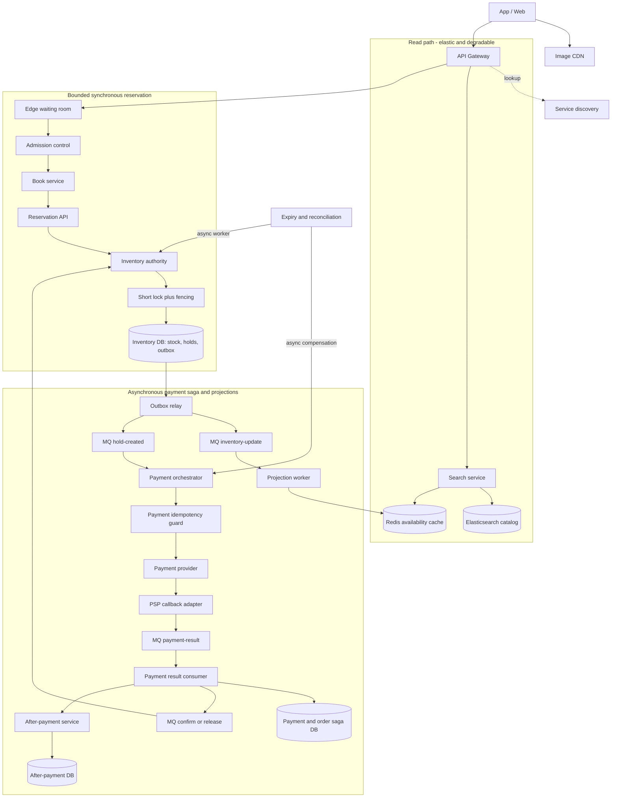

# Flash sale booking & inventory: phân tích bottleneck và ngưỡng chịu tải

## Tóm tắt

Trong kiến trúc ban đầu, request checkout đi theo đường synchronous:

```text
Book Service → acquire inventory lock → Inventory Service → Payment Service
```

Thiết kế này chạy ổn ở tải thông thường nhưng dễ sụp khi flash sale hoặc ngày đôi vì nhiều request cùng tranh chấp một SKU. Tổng RPS của hệ thống không phải con số quyết định; giới hạn thực tế thường nằm ở:

1. Số request bị khuếch đại từ product page thành inventory lookup.
2. Thời gian critical section của một hot SKU.
3. Số database connection bị giữ trong lúc chờ lock hoặc payment.
4. Tốc độ queue nhận việc so với tốc độ worker xử lý được.

Giải pháp đề xuất là tách browse khỏi inventory authoritative, giới hạn demand trước khi tạo work, tạo hold bằng atomic transaction rất ngắn và đưa payment sang durable saga.

> Các con số trong tài liệu là planning assumptions để minh hoạ cách tính, không phải benchmark chung cho PostgreSQL, MySQL hoặc Redis. Ngưỡng production phải được đo lại trên schema, index, hardware, durability và traffic distribution thật.

## 1. Vì sao kiến trúc ban đầu bị block?

### 1.1 Hot SKU là tài nguyên serialized

Giả sử tất cả buyer cùng mua một SKU khuyến mãi. Dù Book Service có 10 hay 100 replica, mọi reservation vẫn phải cập nhật cùng một inventory position.

Ví dụ invariant:

```text
reserved + sold <= sellable
```

Để giữ invariant này, hệ thống phải serialize quyết định trên cùng SKU bằng một trong các cách:

- conditional database update;
- row lock;
- optimistic version;
- atomic Redis script;
- single-writer command partition.

Scale application horizontally chỉ tạo thêm người chờ. Nó không làm critical section của hot key chạy song song được.

### 1.2 Synchronous payment giữ resource quá lâu

Nếu transaction hoặc connection inventory vẫn được giữ trong khi gọi PSP:

- PSP latency kéo dài lock time;
- connection pool bị chiếm;
- timeout tạo retry;
- retry tạo thêm contention;
- contention làm latency tăng tiếp.

Đây là positive feedback loop và có thể biến một lần PSP chậm thành outage của cả checkout.

### 1.3 Browse path khuếch đại inventory read

Nếu một product page hiển thị 20 SKU và gọi Inventory Service riêng cho từng SKU:

```text
4.000 page request/s × 20 SKU = 80.000 inventory lookup/s
```

Con số này xuất hiện trước khi có buyer nào checkout. Nếu lookup đi vào cùng Redis hoặc database dùng cho reservation, read traffic có thể làm nghẽn correctness path.

### 1.4 Shared Redis lock không tự tạo correctness

Một TTL lock có thể hết hạn khi holder vẫn đang xử lý do GC pause, network partition hoặc dependency chậm. Client khác sau đó có thể lấy lock mới trong khi client cũ vẫn ghi.

Nếu mất mutual exclusion làm oversell, cần thêm fencing token hoặc giữ invariant tại database/single-writer authority. Redis lock phù hợp hơn cho efficiency—chẳng hạn tránh chạy trùng job—không nên là lớp bảo vệ duy nhất cho stock correctness.

## 2. Tính ngưỡng chịu tải

### 2.1 Không dùng DAU làm throughput

Một triệu daily active users phân bố đều chỉ tương đương:

```text
1.000.000 / 86.400 ≈ 11,6 user arrival/s
```

Flash sale phải được tính theo launch window. Ví dụ:

- 50.000 người vào trong một phút;
- mỗi người refresh 5 lần;
- chưa tính image, retry và bot.

```text
50.000 × 5 / 60 ≈ 4.167 edge request/s
```

### 2.2 Trần của một hot SKU

Nếu một SKU cần serialize reservation, trần lý thuyết gần đúng là:

```text
hot_sku_capacity ≈ 1 / critical_section_seconds
```

| p99 critical section | Trần lý thuyết | Planning limit ở 60–70% |
|---:|---:|---:|
| 8 ms | 125 reservation/s | 75–88/s |
| 12 ms | 83 reservation/s | 50–58/s |
| 20 ms | 50 reservation/s | 30–35/s |
| 25 ms | 40 reservation/s | 24–28/s |
| 50 ms | 20 reservation/s | 12–14/s |

Phần headroom dành cho:

- latency variance;
- WAL/fsync;
- replica acknowledgment;
- failover;
- serialization retry;
- background maintenance;
- noisy neighbor.

### 2.3 Trần connection pool

Với các transaction độc lập, throughput gần đúng theo Little’s Law:

```text
throughput ≈ usable_connections / average_connection_hold_time
```

Ví dụ:

```text
120 connections / 0,04 s = 3.000 transaction/s
```

Nhưng con số này không áp dụng cho một hot row; hot row vẫn bị giới hạn bởi serial service time.

Nếu connection bị giữ qua payment call trung bình 800 ms:

```text
120 connections / 0,8 s = 150 checkout/s
```

Do đó không được giữ database transaction hoặc inventory lock trong lúc gọi PSP.

### 2.4 Queue không làm tăng capacity

Queue chỉ hấp thụ burst nếu worker có thể drain backlog trong khoảng thời gian còn hữu ích.

Ví dụ một hot SKU xử lý được 50 attempt/s nhưng nhận 2.000 attempt/s:

```text
backlog_growth = 2.000 - 50 = 1.950 message/s
```

Sau 10 giây:

```text
backlog = 19.500 message
drain_time = 19.500 / 50 = 390 giây
```

Một buyer chờ 6,5 phút cho flash sale ngắn gần như không còn giá trị. Trường hợp này phải trả sold-out, busy hoặc Retry-After thay vì tiếp tục queue vô hạn.

## 3. Kiến trúc đề xuất



### 3.0 Ranh giới synchronous và asynchronous

| Đoạn | Kiểu | Lý do và kỹ thuật |
|---|---|---|
| Gateway → waiting room → admission → Book → reservation | Synchronous | Người mua cần câu trả lời ngay: `held`, `queued` hoặc `sold-out`. Admission phải nằm trước Book Service để full burst không vào business tier. |
| Reservation → inventory authority | Synchronous, critical section ngắn | Một conditional write tạo quyết định authoritative; Inventory DB ghi stock, hold và outbox cùng transaction. Lock chỉ tồn tại quanh thao tác stock, không qua network call. |
| Inventory outbox → `inventory-update` → projection | Asynchronous | Search/cache không nằm trên correctness path. MQ at-least-once, consumer idempotent, retry và DLQ. |
| Inventory outbox → `hold-created` → payment orchestrator → PSP | Asynchronous workflow | Payment command chỉ xuất hiện sau hold đã commit, không phải best-effort call từ request. API trả `PAYMENT_PENDING`; workflow giữ deadline, retry/backoff và reconciliation. |
| PSP callback → `payment-result` → saga → `confirm-or-release` → inventory | Asynchronous saga | Callback có thể trùng, đến muộn hoặc out-of-order; chỉ Inventory authority được confirm/release hold và emit inventory update mới. |

Không dùng distributed inventory lock xuyên suốt payment. Nếu cần lock ở booking, đó là lock/fencing ngắn để tránh hai writer cùng quyết định một hold. Ở payment, “lock” nên là idempotency guard + unique state transition (hoặc single-writer theo order), vì giữ lock trong lúc chờ PSP sẽ biến latency bên ngoài thành bottleneck nội bộ.

### 3.0.1 Hợp đồng MQ và command quan trọng

| Queue | Producer | Consumer | Key và đảm bảo |
|---|---|---|---|
| `inventory-update` | Reservation transaction qua transactional outbox | Projection/cache worker, search indexer, analytics | Partition theo `sku_id`, event có `event_id` và `inventory_version`; at-least-once, dedupe theo `(sku_id, version)`; DLQ không được âm thầm bỏ qua. |
| `hold-created` | Inventory outbox sau commit hold | Payment orchestrator | Key theo `hold_id`; tạo một payment intent duy nhất bằng idempotency key, không gọi PSP trực tiếp từ reservation request. |
| `payment-result` | PSP adapter/callback handler | Payment state machine, order saga | Key theo `payment_intent_id`; mọi result có idempotency key, provider attempt và received_at; `unknown` phải reconcile, không tự động coi là failed. |
| `confirm-or-release` | Payment/order saga hoặc expiry worker | Inventory authority | Key theo `hold_id`; mang expected hold state/version, idempotent và là đường duy nhất để đổi `reserved` thành `sold` hoặc trả stock. |

### 3.1 Browse path

- Search và product page đọc availability projection.
- Projection được cập nhật bất đồng bộ từ inventory event.
- Có thể hiển thị `available`, `low stock`, `likely sold out` thay vì số tuyệt đối.
- Confirmation không bao giờ tin projection/cache là authoritative.
- Batch lookup nhiều SKU trong một request thay vì N+1 call.

### 3.2 Waiting room và admission control

Giới hạn theo:

- campaign;
- SKU;
- account;
- device/API key;
- weighted request cost;
- concurrent hold.

Waiting room chỉ phát token theo rate đã benchmark được. Token nên:

- sống ngắn;
- ký chống giả mạo;
- bind campaign/SKU/user;
- chỉ dùng một lần hoặc có idempotency key;
- không tiết lộ exact queue position nếu không thể đảm bảo.

### 3.3 Atomic inventory hold

Transaction reservation phải thật ngắn:

```sql
UPDATE inventory_position
SET reserved = reserved + :quantity,
    version = version + 1
WHERE sku_id = :sku_id
  AND sellable - reserved - sold >= :quantity
RETURNING version;
```

Đây là default cho hot SKU: database serialize row write và không bắt client đọc `expected_version` rồi retry hàng loạt. Cùng transaction phải insert `hold` và `hold-created`/`inventory-update` vào outbox. Nếu dùng distributed lock như lớp giảm contention, authority còn phải persist fencing token và reject writer cũ bằng điều kiện kiểu `last_fence < :fencing_token`; TTL Redis không thay thế điều kiện này.

Nếu affected rows bằng zero, request phải phân biệt:

- sold out;
- idempotency key đã có hold;
- fencing token stale;
- policy limit;
- transaction lỗi tạm thời được phép retry có backoff và retry budget.

Không gọi Payment Service bên trong transaction này. Sau commit, outbox relay phát `hold-created`; payment worker tạo payment intent và gọi PSP ngoài connection/lock inventory.

### 3.4 Payment saga

Một flow khả thi:

```text
HOLD_CREATED
  → PAYMENT_AUTHORIZING
  → PAYMENT_AUTHORIZED
  → ORDER_CONFIRMED
```

Các nhánh lỗi:

```text
PAYMENT_FAILED  → HOLD_RELEASED
HOLD_EXPIRED    → PAYMENT_CANCEL/REFUND nếu cần
PAYMENT_UNKNOWN → RECONCILING
```

Mọi command phải có idempotency key và request fingerprint. Timeout không được hiểu là payment thất bại; nó là outcome chưa biết và phải query/reconcile với PSP.

### 3.5 Lock/fencing ở booking và payment

Booking chỉ cần lock trong critical section ngắn. Nếu dùng Redis hoặc một lock service để giảm concurrent writer, flow phải có fencing chứ không chỉ có TTL:

```text
1. Nếu cần, acquire lock:inventory:{sku} với owner token và lease rất ngắn.
2. Authority cấp fencing token tăng dần; token là một phần của command, không phải metadata ở Redis.
3. Conditional write kiểm tra stock và `last_fence < token`, rồi persist `last_fence = token` cùng hold.
4. Commit inventory position + hold + outbox trong cùng transaction.
5. Release lock; writer cũ bị pause sau lease vẫn bị authority reject vì token nhỏ hơn.
```

Lock chỉ là lớp giảm tranh chấp. Invariant vẫn phải nằm ở database constraint, conditional update hoặc single-writer authority. Nếu database conditional update đã đủ nhanh, bỏ lock là phương án đơn giản và đáng tin hơn; Redis replication/failover không được mặc định là bằng chứng mutual exclusion tuyệt đối.

Payment không nên giữ distributed lock inventory trong lúc chờ PSP. “Lock” của payment là một payment intent duy nhất và compare-and-set state transition:

```text
payment_intent (payment_intent_id UNIQUE, idempotency_key UNIQUE, order_id, state, version)

PENDING → AUTHORIZING → AUTHORIZED | FAILED | UNKNOWN
```

Chỉ một consumer được chuyển state bằng `WHERE version = expected_version`; callback trùng sẽ thành no-op. Nếu PSP timeout, chuyển `UNKNOWN`, publish/query qua `payment-result` và reconcile trước khi release hold hoặc refund. Như vậy payment vẫn có concurrency guard nhưng không biến latency của PSP thành thời gian giữ lock nội bộ.

### 3.6 Traffic lifecycle: low traffic, pre-peak, surge, protect và recovery

Không có một policy autoscaling đúng cho mọi thời điểm. Flash sale cần state machine vận hành; mỗi state thay đổi capacity, admission và user contract theo một cách có chủ đích.

| Chế độ | Tín hiệu vào | Hành động hệ thống | User thấy gì | Không được làm |
|---|---|---|---|---|
| **Low traffic** | Không có campaign, queue age gần 0, payment pending/expiry backlog đã drain | Hạ dần stateless API/search/worker về floor; tắt analytics, reindex và notification không có deadline | Browse và checkout bình thường | Không scale-to-zero Inventory authority, outbox relay, expiry/reconciliation, PSP callback receiver, DB HA hoặc observability |
| **Pre-peak** | Campaign đã biết lịch và thời gian warm-up đã đo | Tăng min replica tạm thời, pre-warm CDN/cache/connection pool, reserve DB/PSP budget, freeze migration/index rebuild, bật policy admission ở shadow | Có countdown; chưa queue người dùng | Không đợi CPU hoặc queue lag tăng mới scale; khi đó cold start đã nằm trên đường checkout |
| **Surge** | Edge RPS/concurrent users tăng nhanh nhưng hold latency còn trong SLO | Scale CDN/read/API theo signal riêng, phát token theo safe admission rate, scale consumer tới downstream budget | `held`, queue range hoặc `Retry-After` rõ ràng | Không tăng consumer/pod vô hạn; hot SKU và PSP không tự nhanh hơn vì có thêm replica |
| **Protect / overload** | p99 lock wait, DB pool, queue age hoặc PSP pending vượt guardrail | Giảm admission riêng hot SKU, shed browse feature, serve stale availability band, pause nonessential worker, circuit-break PSP khi policy cho phép | `queued`, `busy`, `sold-out` hoặc `payment pending` trung thực | Không giấu demand trong queue vô hạn, không retry đồng loạt, không mở lại full traffic chỉ vì một pod vừa khỏe |
| **Sold-out / recovery** | Sellable quota = 0 hoặc dependency đã ổn định qua một stability window | Dừng issue hold mới, drain/reconcile payment & expiry, ramp admission từng bước, rồi scale-in có hysteresis | Sold-out rõ ràng; status order vẫn hoạt động | Không scale-in khi outbox/expiry/pending payment còn backlog, không trả stock chỉ vì callback đến muộn |

`Autoscaling` chỉ mua thêm năng lực ở thành phần có thể song song. Với một SKU viral, inventory vẫn có serial ceiling; state Protect phải giảm demand trước khi thêm compute.

### 3.7 Scale-out theo component, không theo một chỉ số CPU chung

| Thành phần | Scale ngang có ích? | Signal scale-up đúng | Giới hạn không được vượt | Khi nào scale không giúp |
|---|---|---|---|---|
| CDN, Redis read cache, Search | Có | origin RPS, cache-miss, search p99 | Cache miss không được dội vào Inventory DB | Một hot key vẫn nằm trên một cache shard/slot |
| Gateway, waiting room, Book API | Có | in-flight request, request/target, p99, CPU sau khi đã có admission | Per-campaign/SKU/user concurrency và DB connection budget | Nếu admission ở sau Book hoặc DB đã saturated |
| Projection/notification worker | Có | oldest-message age, input/output rate, hot-partition lag | Số partition và write budget của cache/index | Thêm consumer vượt partition chỉ tạo idle worker |
| Payment worker | Có, có cap | payment-command age, pending age, PSP latency/error | PSP/fraud provider concurrency, idempotency store và retry budget | PSP chậm hoặc `UNKNOWN` tăng; scale worker chỉ tạo nhiều request hơn |
| Inventory authority | Chỉ với nhiều SKU độc lập | partition skew, lock wait, hold p99 | Safe hold rate **riêng từng hot SKU** | Một row/key hot vẫn serialized; thêm pod chỉ thêm waiter |
| DB read replica | Có cho browse/report | replica CPU, replica lag, query p99 | Freshness SLO | Không tăng write capacity của row inventory hot |

Với queue, đặt control loop rõ ràng:

```text
desired_consumer_rate = min(queue-derived demand, safe_downstream_rate)

safe_downstream_rate = min(DB headroom, PSP/fraud headroom, per-SKU safe hold rate)
```

Nếu producer vượt `safe_downstream_rate`, autoscaling consumer không phải câu trả lời đầy đủ: backlog chỉ đổi thành latency. Gateway phải giảm admission, quota hoặc trả `Retry-After` trước khi queue age vượt business window.

### 3.8 Low-traffic cost mode và scale-in an toàn

Khi user ít, không nên “cắt hết”. Chia component thành ba nhóm để giảm cost mà không mất correctness hoặc tạo cold start đúng lúc campaign mở.

| Nhóm | Có thể giảm thế nào | Giữ lại vì sao |
|---|---|---|
| **Scale to zero khi phù hợp** | Analytics, report, search reindex, bulk notification, batch repair không có deadline ngắn | Các job này có thể chờ trigger/queue và chấp nhận cold start |
| **Scale về floor** | Search replica, projection worker, Book API, payment worker | Giữ baseline để nhận checkout/callback, tránh warm-up nằm trên request đầu tiên; floor cần dựa trên SLO, không phải bằng 0 mặc định |
| **Không scale to zero** | Inventory authority, DB primary/standby, broker persistence, outbox relay, hold-expiry, reconciliation, PSP callback receiver, alerting | Đây là đường correctness/recovery; mất chúng khiến hold mắc kẹt, callback trễ hoặc observability mù đúng lúc cần điều tra |

Chỉ cho scale-in khi **tất cả** điều kiện sau ổn định qua cooldown/hysteresis đã đo:

1. Không active campaign hoặc campaign đã qua recovery window.
2. `oldest-message-age` và outbox lag dưới SLO; không có hot partition lag bất thường.
3. Payment `UNKNOWN`/pending không tăng, expiry backlog bằng 0 hoặc đang drain trong deadline.
4. p99 hold latency, DB pool, lock wait và PSP error trở về baseline.
5. Worker nhận tín hiệu drain: ngừng nhận message mới, hoàn thành/checkpoint message hiện tại, release lease rồi mới terminate.

Giảm `maxConnections` hoặc replica mà không tính lại total connection budget sẽ gây connection storm ở lần scale-up kế tiếp. Budget phải được giữ theo tổng:

```text
total_db_connections =
  book_replicas × book_pool
  + payment_workers × payment_pool
  + outbox + expiry + reconciliation + admin_reserve
  ≤ usable_db_connection_budget
```

Reservation/Inventory cần pool quota riêng; browse hoặc batch job không được ăn hết connection dành cho hold.

### 3.9 Peak bottleneck ladder: signal → action → long-term fix

| Tín hiệu | Bottleneck thật | Hành động trong vài phút | Cải tiến dài hạn / trade-off |
|---|---|---|---|
| Hot SKU chiếm phần lớn command, p99 lock wait tăng | Một stock row/partition serialized | Hạ admission riêng SKU, per-user cap, queue/sold-out sớm | Single writer theo SKU, quota bucket/cell hoặc lottery; đổi lại có stranded quota, fairness và reconcile phức tạp |
| DB pool vượt budget, transaction time tăng | Connection storm hoặc I/O/WAL pressure | Hạ app concurrency/pool, shed browse, dừng batch write | Pool quota/proxy, index/transaction tuning; replica chỉ giúp read |
| Queue age tăng khi consumer đã chạm safe rate | Arrival rate lớn hơn drain rate | Stop admit mới, `Retry-After`, scale read path chứ không đẩy thêm vào authority | Pre-scale theo lịch, tách cell/campaign; queue không tạo capacity mới |
| PSP timeout, `UNKNOWN`, pending age tăng | External dependency chậm hoặc rate-limited | Freeze/giảm admission theo PSP budget, circuit breaker, reconcile thay vì retry đồng loạt | Provider fallback theo policy, idempotency/reconciliation mạnh hơn; fallback làm compliance và UX phức tạp |
| Cache miss hoặc status polling spike | Cache stampede / thundering herd | Serve stale availability, cache sold-out/negative result, backoff status poll | Stale-while-revalidate, request coalescing, push status; đổi lại browse có thể stale |
| Nhiều hold cùng expire | Expiry wave cùng lúc ghi một hot SKU | Bucket/jitter `expires_at`, partition expiry worker | Điều chỉnh TTL và batch release; TTL dài tăng conversion nhưng khóa inventory lâu hơn |

## 4. Mô hình dữ liệu

| Model | Trách nhiệm | Correctness |
|---|---|---|
| Campaign/SKU policy | quota, per-user limit, admission rate/burst, thời gian chạy, lifecycle mode | policy version đi cùng mọi decision và đổi mode audit được |
| Inventory position | on-hand, reserved, sold, safety stock, version, last_fence | `reserved + sold <= sellable`; Inventory Service là authority duy nhất |
| Hold | user, SKU, quantity, state, expiry, fencing version | idempotent; một active hold trên business key nếu cần |
| Payment/order saga | hold/payment reference, deadline, next action, provider attempt | state transition hợp lệ, payment DB sở hữu intent; không có distributed transaction với inventory |
| Outbox/inbox | event ID, aggregate version, schema, processing state, event age | publish/consume idempotent; `hold-created` chỉ phát sau commit |
| Capacity policy | campaign mode, warm-up window, min/max replica, admission/PSP/DB budget, cooldown version | policy thay đổi không làm vỡ inventory; có rollback và audit |
| Worker drain lease | consumer, partition/message, visibility deadline, checkpoint, termination state | scale-in không mất work hay duplicate side effect |
| Availability projection | approximate availability và observed time | rebuild được; không dùng để confirm |

## 5. PostgreSQL/MySQL, Redis hay single writer?

| Phương án | Phù hợp khi | Điểm mạnh | Chi phí/rủi ro |
|---|---|---|---|
| Conditional SQL update | Không chấp nhận oversell | Invariant và durability rõ, audit dễ | Một hot SKU có serial ceiling |
| `SELECT FOR UPDATE` ngắn | Logic reservation cần đọc nhiều state cùng transaction | Dễ suy luận | Lock wait cao nếu critical section dài |
| Optimistic version | Conflict thường thấp hoặc retry rẻ | Không giữ lock trong lúc xử lý ngoài DB | Flash sale hot key có thể tạo retry storm |
| Redis atomic script | Cần latency rất thấp và đã có recovery contract | Atomic, nhanh, dễ rate limit theo key | Durability/failover/repair phức tạp hơn |
| Single writer theo SKU partition | Cần order rõ và throughput dự đoán được | Không có concurrent writer trong partition | Viral SKU vẫn bị giới hạn một partition |
| Quota bucket/cell | Một SKU phải phục vụ nhiều region/cell | Không cần global write trên mỗi order | Stranded quota và rebalance phức tạp |

Khuyến nghị mặc định khi oversell là lỗi nghiêm trọng:

1. Database là inventory authority.
2. Redis phục vụ admission, cache và token.
3. Reservation transaction cực ngắn.
4. Payment và projection đi qua outbox/queue.
5. Chỉ chuyển authority sang Redis/single-writer sau khi benchmark chứng minh database hot-key là giới hạn và business chấp nhận recovery model mới.

### 5.1 Pro/con của design hiện tại và điều kiện đổi chiến lược

| Quyết định | Lợi ích ở tải thường / low traffic | Giá phải trả khi peak | Khi nào cần nâng cấp |
|---|---|---|---|
| Book → Inventory → Payment synchronous | Dễ giải thích; buyer nhận final result ngay; ít state pending | PSP chậm giữ thread/connection/hold, retry tạo feedback loop; toàn checkout phụ thuộc dependency chậm nhất | Khi payment p99 hoặc unknown outcome ăn vào hold TTL/DB pool; tách payment saga async |
| Shared Book + Payment DB | Ít hop, join/report đơn giản, vận hành ban đầu nhẹ | Service coupling, shared connection pool, khó deploy/scale riêng; không thay thế distributed transaction với Inventory DB | Khi payment worker/callback làm ảnh hưởng booking; tách ownership Order/Payment khỏi Inventory |
| Redis TTL lock cho booking | Latency thấp, giảm duplicate work và waiting ngắn | Lease expiry/failover không tự bảo vệ stock; hot key vẫn một slot/node | Nếu mất lock có thể oversell; dùng DB conditional update/fencing hoặc single writer |
| MQ chỉ cho inventory update và payment result | Browse và webhook được tách khỏi request path | Hold commit có thể không tạo payment nếu payment command là direct call; payment result không tự confirm/release inventory | Phát `hold-created` và `confirm-or-release` từ outbox/saga |
| Autoscale mọi app pod | Tốt cho gateway, search, stateless Book API, projection | Không tăng throughput một stock row, có thể exhaust DB/PSP connection budget nhanh hơn | Khi p99 lock wait/hot partition tăng; dùng per-SKU admission, quota bucket/cell hoặc serialized lane |
| Cache availability | Gỡ read burst và rẻ khi low traffic | Stale/sold-out sai; cache stampede có thể dội về authority | Khi cache miss/refresh spike; stale-while-revalidate, coalescing, sold-out negative cache |
| Scheduled pre-warm | Đón ngày đôi/campaign có lịch, không để cold start ở checkout | Tốn tiền capacity nhàn rỗi, cần dự báo và rollback | Khi startup/warm-up dài hơn thời gian user chấp nhận chờ; chỉ warm đúng path critical |
| Scale-to-zero worker | Giảm cost cho analytics/reindex/notification không gấp | Cold start, message replay, mất callback nhanh nếu dùng nhầm cho correctness path | Chỉ dùng cho work có deadline chịu được; giữ floor cho payment, expiry, outbox và inventory |

## 6. Benchmark để tìm ngưỡng thật

### Workload cần mô phỏng

- Poisson arrival ở normal load.
- Synchronized burst lúc mở campaign.
- Zipf/hot-key distribution thay vì SKU phân bố đều.
- Client timeout và retry.
- Bot dùng nhiều IP/account/device.
- Payment latency distribution thật.
- WAL, synchronous replication, index và constraint giống production.
- Hold expiry worker và outbox relay chạy đồng thời.
- Autoscaler warm-up/startup, scheduled pre-scale và reactive scale-out để đo khoảng demand chưa được phục vụ.
- Connection budget theo số replica/pool thực, không chỉ một client benchmark vào DB.
- Cache stampede, status polling sau checkout và expiry wave cùng một thời điểm.
- Scale-in giữa lúc worker đang nhận message: drain, checkpoint, visibility timeout và redelivery.

### Quy trình

1. Benchmark atomic hold riêng để đo critical section.
2. Chạy target rate tăng từng bậc, ví dụ 20, 30, 40, 50, 60 attempt/s cho một hot SKU.
3. Giữ mỗi bậc đủ lâu để thấy WAL checkpoint, GC và queue behavior.
4. Thêm flash burst cao hơn steady state 10–20 lần; đo backlog xuất hiện trong thời gian autoscaler warm-up.
5. Tìm điểm p99 latency, schedule lag hoặc retry tăng phi tuyến.
6. Đặt admission limit thấp hơn saturation knee và thêm headroom; tính riêng hot-SKU, global DB và PSP budget.
7. Chạy state Protect: hạ admission, serve stale browse, kiểm tra queue age có trở lại hữu ích hay không.
8. Chạy recovery rồi scale-in: đảm bảo worker drain an toàn, pending payment/expiry/outbox về 0 trước khi giảm floor.
9. Lặp lại với DB failover, Redis loss và PSP chậm.

PostgreSQL `pgbench --rate` báo schedule lag khi target rate vượt capacity. Cần dùng custom script giống transaction reservation thật thay vì lấy TPS của workload mặc định làm kết luận.

### Metrics bắt buộc

| Layer | Metrics |
|---|---|
| Edge | admitted, rejected, token age, bot/challenge result |
| Reservation | attempts, success, sold-out, conflict, p50/p95/p99 |
| Database | lock wait, pool usage, transaction time, WAL/fsync, deadlock, serialization retry |
| Queue | input/output rate, depth, oldest-message age, retry, DLQ |
| Payment | authorization latency, unknown result, callback duplicate, pending age |
| Correctness | negative inventory, duplicate confirmation, expired-hold race, reconciliation mismatch |
| Autoscaling | desired/current replicas, startup/warm-up, scale event reason, cooldown, rejected scale-in |
| Capacity policy | active campaign mode, per-SKU admission, DB/PSP budget used, protection-mode duration |

Không dùng SKU ID hoặc user ID trực tiếp làm metric label vì cardinality có thể tăng vô hạn. Chi tiết high-cardinality nên đi vào sampled trace hoặc structured log.

## 7. Planning limit ban đầu

Giả sử benchmark cho p99 atomic hold là 12 ms:

- hot SKU admission: 50 attempt/s;
- burst ngắn: cấu hình riêng sau benchmark, không mặc định vô hạn;
- edge waiting-room age tối đa: 10 giây;
- số attempt đã admit tối đa: khoảng 500/SKU;
- DB pool sử dụng dưới 70%;
- p99 lock wait dưới 20 ms;
- hold API dưới 250 ms;
- post-admission backend queue age dưới 2 giây;
- zero negative inventory.

Hai queue age này khác nhau: user có thể đợi tối đa 10 giây ở edge trước khi được token, nhưng sau khi đã admit thì request không được nằm thêm quá 2 giây trong backend. Nếu backend queue age tăng, system phải hạ admission trước—không đổ thêm token để giữ “queue position” đẹp.

Admission rate cuối cùng không chỉ lấy từ hot-SKU benchmark:

```text
admission_rate = min(
  hot_sku_safe_hold_rate,
  global_DB_headroom,
  PSP_and_fraud_safe_concurrency,
  useful_queue_drain_rate
)
```

Nếu campaign có 100 đơn vị hàng, không cần admit hàng chục nghìn buyer vào correctness path. Cap active hold theo stock còn lại, conversion probability và hold timeout; chỉ phát token mới khi hold release/expire hoặc budget tăng. PSP chậm/error phải làm giảm admission trước khi active holds chiếm hết quota.

## 8. Failure review

| Failure | Hệ quả | Detection | Containment/recovery |
|---|---|---|---|
| Redis mất | mất cache/token hoặc lock | Redis error, cache miss spike | DB invariant vẫn đúng; giảm admission hoặc fail closed checkout |
| DB primary failover | hold timeout, outcome không rõ | connection error, transaction unknown | retry theo idempotency; không retry mù sau commit ambiguity |
| Autoscaler phản ứng muộn | spike đã làm queue/DB quá tải trước khi pod ấm | startup time, edge reject, queue age trong warm-up | scheduled pre-warm cho campaign; waiting room/admission che warm-up, không queue vô hạn |
| App scale-out tạo connection storm | thêm pod làm DB pool vượt budget | total connection, wait, pool timeout | quota pool theo workload, hạ app concurrency, reserve connection cho inventory |
| Scale-in giết worker đang xử lý | message redelivery, duplicate PSP call hoặc mất progress | termination/rebalance, duplicate counter, unacked message | drain/checkpoint/lease trước terminate; idempotency ở mọi side effect |
| PSP timeout | payment có thể đã thành công | pending age, provider query | chuyển `PAYMENT_UNKNOWN`, reconcile trước compensate |
| Hold đã commit nhưng payment command chưa bền | stock bị reserve mà không bắt đầu payment | hold age không có payment intent | `hold-created` qua inventory outbox, không direct call từ reservation request |
| Hold hết hạn cùng lúc payment success | có thể release stock đã trả tiền | state/version conflict | fencing version; saga quyết định confirm/refund |
| Duplicate callback/event | confirm hoặc release lặp | inbox duplicate counter | idempotent state transition và unique event ID |
| Projection lag | browse quảng cáo stock đã hết | event-to-visible lag | hiển thị approximate state; hold vẫn revalidate authority |
| Queue lag/hot partition | payment/confirmation chậm dù total depth còn thấp | oldest-message age, max-partition lag, input/output rate | scale consumer có giới hạn; reject admission nếu drain time quá dài, repartition chỉ giúp nhiều key chứ không giúp một SKU |
| Expiry wave/cache stampede | burst ghi/rebuild dội vào hot authority | expiry bucket size, cache miss, origin RPS | jitter expiry, coalesce cache miss, stale-while-revalidate, cache sold-out |
| Bot identity phân tán | vượt per-IP limit | behavior/device/account signals | layered limit, per-account/SKU cap, challenge |
| Retry storm | traffic tăng sau timeout | attempt/original ratio | Retry-After, jitter, idempotency và truthful pending response |

## 9. Rollout

1. Thêm metrics và benchmark trước khi đổi kiến trúc.
2. Tách browse availability sang projection/cache.
3. Rút transaction hold xuống còn atomic stock decision + hold + inventory outbox.
4. Phát `hold-created` từ outbox, tạo payment intent ở worker và phát `confirm-or-release` quay về Inventory authority.
5. Chạy admission control ở shadow mode để so accepted/rejected decision; test cả per-SKU và global DB/PSP budget.
6. Viết policy Normal/Pre-peak/Surge/Protect/Recovery, kèm owner, dashboard, rollback và user response cho từng mode.
7. Chạy scheduled pre-warm cho một campaign nhỏ; đo startup/warm-up và chênh lệch so với reactive autoscale.
8. Failure drill Redis loss, DB failover, PSP timeout, outbox lag, hot partition, expiry wave và scale-in giữa lúc worker đang chạy.
9. Chỉ tăng rate sau khi p99, lock wait, pool usage, queue age và correctness SLI còn headroom.
10. Sau campaign, verify reconciliation rồi mới scale-in; ghi lại saturation knee và điều chỉnh policy version cho lần tiếp theo.

## Nguồn tham khảo

- [PostgreSQL — pgbench target rate, schedule lag và retry statistics](https://www.postgresql.org/docs/17/pgbench.html)
- [PostgreSQL — quan sát lock bằng `pg_locks`](https://www.postgresql.org/docs/current/view-pg-locks.html)
- [PostgreSQL — transaction isolation và serialization retry](https://www.postgresql.org/docs/current/transaction-iso.html)
- [Redis — real-time inventory reservation](https://redis.io/tutorials/inventory-reservation-in-real-time-with-redis/)
- [Redis — distributed locks, fencing và failure assumptions](https://redis.io/docs/latest/develop/clients/patterns/distributed-locks/)
- [Redis — atomic execution của Lua script](https://redis.io/docs/latest/develop/programmability/eval-intro/)
- [Azure — Queue-Based Load Leveling](https://learn.microsoft.com/en-us/azure/architecture/patterns/queue-based-load-leveling)
- [Azure — Design to scale out and scale in](https://learn.microsoft.com/en-us/azure/architecture/guide/design-principles/scale-out)
- [Azure — Background-job autoscaling and graceful scale-in](https://learn.microsoft.com/en-us/azure/architecture/best-practices/background-jobs)
- [AWS — Target-tracking metrics, warm-up and gradual scale-in](https://docs.aws.amazon.com/autoscaling/ec2/userguide/as-scaling-target-tracking.html)
- [Stripe — idempotent requests](https://docs.stripe.com/api/idempotent_requests)
- [Google SRE — Addressing Cascading Failures](https://sre.google/sre-book/addressing-cascading-failures/)
