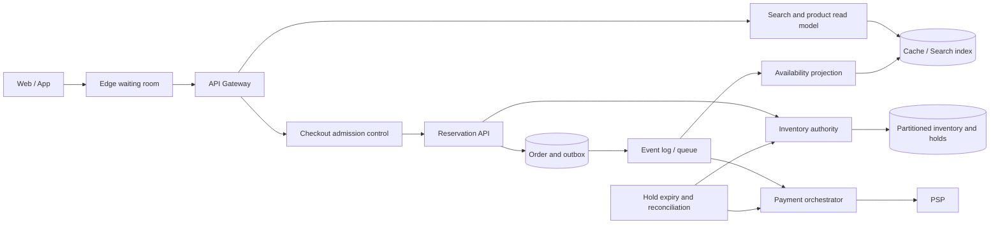

# Flash sale booking & inventory: phân tích bottleneck và ngưỡng chịu tải

## Tóm tắt

Trong kiến trúc ban đầu, request checkout đi theo đường synchronous:

```text
Book Service → acquire inventory lock → Inventory Service → Payment Service
```

Thiết kế này chạy ổn ở tải thông thường nhưng dễ sụp khi flash sale hoặc ngày đôi vì nhiều request cùng tranh chấp một SKU. Tổng RPS của hệ thống không phải con số quyết định; giới hạn thực tế thường nằm ở:

1. Số request bị khuếch đại từ product page thành inventory lookup.
2. Thời gian critical section của một hot SKU.
3. Số database connection bị giữ trong lúc chờ lock hoặc payment.
4. Tốc độ queue nhận việc so với tốc độ worker xử lý được.

Giải pháp đề xuất là tách browse khỏi inventory authoritative, giới hạn demand trước khi tạo work, tạo hold bằng atomic transaction rất ngắn và đưa payment sang durable saga.

> Các con số trong tài liệu là planning assumptions để minh hoạ cách tính, không phải benchmark chung cho PostgreSQL, MySQL hoặc Redis. Ngưỡng production phải được đo lại trên schema, index, hardware, durability và traffic distribution thật.

## 1. Vì sao kiến trúc ban đầu bị block?

### 1.1 Hot SKU là tài nguyên serialized

Giả sử tất cả buyer cùng mua một SKU khuyến mãi. Dù Book Service có 10 hay 100 replica, mọi reservation vẫn phải cập nhật cùng một inventory position.

Ví dụ invariant:

```text
reserved + sold <= sellable
```

Để giữ invariant này, hệ thống phải serialize quyết định trên cùng SKU bằng một trong các cách:

- conditional database update;
- row lock;
- optimistic version;
- atomic Redis script;
- single-writer command partition.

Scale application horizontally chỉ tạo thêm người chờ. Nó không làm critical section của hot key chạy song song được.

### 1.2 Synchronous payment giữ resource quá lâu

Nếu transaction hoặc connection inventory vẫn được giữ trong khi gọi PSP:

- PSP latency kéo dài lock time;
- connection pool bị chiếm;
- timeout tạo retry;
- retry tạo thêm contention;
- contention làm latency tăng tiếp.

Đây là positive feedback loop và có thể biến một lần PSP chậm thành outage của cả checkout.

### 1.3 Browse path khuếch đại inventory read

Nếu một product page hiển thị 20 SKU và gọi Inventory Service riêng cho từng SKU:

```text
4.000 page request/s × 20 SKU = 80.000 inventory lookup/s
```

Con số này xuất hiện trước khi có buyer nào checkout. Nếu lookup đi vào cùng Redis hoặc database dùng cho reservation, read traffic có thể làm nghẽn correctness path.

### 1.4 Shared Redis lock không tự tạo correctness

Một TTL lock có thể hết hạn khi holder vẫn đang xử lý do GC pause, network partition hoặc dependency chậm. Client khác sau đó có thể lấy lock mới trong khi client cũ vẫn ghi.

Nếu mất mutual exclusion làm oversell, cần thêm fencing token hoặc giữ invariant tại database/single-writer authority. Redis lock phù hợp hơn cho efficiency—chẳng hạn tránh chạy trùng job—không nên là lớp bảo vệ duy nhất cho stock correctness.

## 2. Tính ngưỡng chịu tải

### 2.1 Không dùng DAU làm throughput

Một triệu daily active users phân bố đều chỉ tương đương:

```text
1.000.000 / 86.400 ≈ 11,6 user arrival/s
```

Flash sale phải được tính theo launch window. Ví dụ:

- 50.000 người vào trong một phút;
- mỗi người refresh 5 lần;
- chưa tính image, retry và bot.

```text
50.000 × 5 / 60 ≈ 4.167 edge request/s
```

### 2.2 Trần của một hot SKU

Nếu một SKU cần serialize reservation, trần lý thuyết gần đúng là:

```text
hot_sku_capacity ≈ 1 / critical_section_seconds
```

| p99 critical section | Trần lý thuyết | Planning limit ở 60–70% |
|---:|---:|---:|
| 8 ms | 125 reservation/s | 75–88/s |
| 12 ms | 83 reservation/s | 50–58/s |
| 20 ms | 50 reservation/s | 30–35/s |
| 25 ms | 40 reservation/s | 24–28/s |
| 50 ms | 20 reservation/s | 12–14/s |

Phần headroom dành cho:

- latency variance;
- WAL/fsync;
- replica acknowledgment;
- failover;
- serialization retry;
- background maintenance;
- noisy neighbor.

### 2.3 Trần connection pool

Với các transaction độc lập, throughput gần đúng theo Little’s Law:

```text
throughput ≈ usable_connections / average_connection_hold_time
```

Ví dụ:

```text
120 connections / 0,04 s = 3.000 transaction/s
```

Nhưng con số này không áp dụng cho một hot row; hot row vẫn bị giới hạn bởi serial service time.

Nếu connection bị giữ qua payment call trung bình 800 ms:

```text
120 connections / 0,8 s = 150 checkout/s
```

Do đó không được giữ database transaction hoặc inventory lock trong lúc gọi PSP.

### 2.4 Queue không làm tăng capacity

Queue chỉ hấp thụ burst nếu worker có thể drain backlog trong khoảng thời gian còn hữu ích.

Ví dụ một hot SKU xử lý được 50 attempt/s nhưng nhận 2.000 attempt/s:

```text
backlog_growth = 2.000 - 50 = 1.950 message/s
```

Sau 10 giây:

```text
backlog = 19.500 message
drain_time = 19.500 / 50 = 390 giây
```

Một buyer chờ 6,5 phút cho flash sale ngắn gần như không còn giá trị. Trường hợp này phải trả sold-out, busy hoặc Retry-After thay vì tiếp tục queue vô hạn.

## 3. Kiến trúc đề xuất



### 3.1 Browse path

- Search và product page đọc availability projection.
- Projection được cập nhật bất đồng bộ từ inventory event.
- Có thể hiển thị `available`, `low stock`, `likely sold out` thay vì số tuyệt đối.
- Confirmation không bao giờ tin projection/cache là authoritative.
- Batch lookup nhiều SKU trong một request thay vì N+1 call.

### 3.2 Waiting room và admission control

Giới hạn theo:

- campaign;
- SKU;
- account;
- device/API key;
- weighted request cost;
- concurrent hold.

Waiting room chỉ phát token theo rate đã benchmark được. Token nên:

- sống ngắn;
- ký chống giả mạo;
- bind campaign/SKU/user;
- chỉ dùng một lần hoặc có idempotency key;
- không tiết lộ exact queue position nếu không thể đảm bảo.

### 3.3 Atomic inventory hold

Transaction reservation phải thật ngắn:

```sql
UPDATE inventory_position
SET reserved = reserved + :quantity,
    version = version + 1
WHERE sku_id = :sku_id
  AND version = :expected_version
  AND sellable - reserved - sold >= :quantity;
```

Sau đó insert hold và outbox trong cùng transaction. Nếu affected rows bằng zero, request phải phân biệt:

- sold out;
- version conflict có thể retry;
- policy limit;
- hold đã tồn tại do idempotency.

Không gọi Payment Service bên trong transaction này.

### 3.4 Payment saga

Một flow khả thi:

```text
HOLD_CREATED
  → PAYMENT_AUTHORIZING
  → PAYMENT_AUTHORIZED
  → ORDER_CONFIRMED
```

Các nhánh lỗi:

```text
PAYMENT_FAILED  → HOLD_RELEASED
HOLD_EXPIRED    → PAYMENT_CANCEL/REFUND nếu cần
PAYMENT_UNKNOWN → RECONCILING
```

Mọi command phải có idempotency key và request fingerprint. Timeout không được hiểu là payment thất bại; nó là outcome chưa biết và phải query/reconcile với PSP.

## 4. Mô hình dữ liệu

| Model | Trách nhiệm | Correctness |
|---|---|---|
| Campaign/SKU policy | quota, per-user limit, admission rate/burst, thời gian chạy | policy version đi cùng mọi decision |
| Inventory position | on-hand, reserved, sold, safety stock, version | `reserved + sold <= sellable` |
| Hold | user, SKU, quantity, state, expiry, fencing version | idempotent; một active hold trên business key nếu cần |
| Order saga | hold/payment reference, deadline, next action | state transition hợp lệ và audit được |
| Outbox/inbox | event ID, aggregate version, schema, processing state | publish/consume idempotent |
| Availability projection | approximate availability và observed time | rebuild được; không dùng để confirm |

## 5. PostgreSQL/MySQL, Redis hay single writer?

| Phương án | Phù hợp khi | Điểm mạnh | Chi phí/rủi ro |
|---|---|---|---|
| Conditional SQL update | Không chấp nhận oversell | Invariant và durability rõ, audit dễ | Một hot SKU có serial ceiling |
| `SELECT FOR UPDATE` ngắn | Logic reservation cần đọc nhiều state cùng transaction | Dễ suy luận | Lock wait cao nếu critical section dài |
| Optimistic version | Conflict thường thấp hoặc retry rẻ | Không giữ lock trong lúc xử lý ngoài DB | Flash sale hot key có thể tạo retry storm |
| Redis atomic script | Cần latency rất thấp và đã có recovery contract | Atomic, nhanh, dễ rate limit theo key | Durability/failover/repair phức tạp hơn |
| Single writer theo SKU partition | Cần order rõ và throughput dự đoán được | Không có concurrent writer trong partition | Viral SKU vẫn bị giới hạn một partition |
| Quota bucket/cell | Một SKU phải phục vụ nhiều region/cell | Không cần global write trên mỗi order | Stranded quota và rebalance phức tạp |

Khuyến nghị mặc định khi oversell là lỗi nghiêm trọng:

1. Database là inventory authority.
2. Redis phục vụ admission, cache và token.
3. Reservation transaction cực ngắn.
4. Payment và projection đi qua outbox/queue.
5. Chỉ chuyển authority sang Redis/single-writer sau khi benchmark chứng minh database hot-key là giới hạn và business chấp nhận recovery model mới.

## 6. Benchmark để tìm ngưỡng thật

### Workload cần mô phỏng

- Poisson arrival ở normal load.
- Synchronized burst lúc mở campaign.
- Zipf/hot-key distribution thay vì SKU phân bố đều.
- Client timeout và retry.
- Bot dùng nhiều IP/account/device.
- Payment latency distribution thật.
- WAL, synchronous replication, index và constraint giống production.
- Hold expiry worker và outbox relay chạy đồng thời.

### Quy trình

1. Benchmark atomic hold riêng để đo critical section.
2. Chạy target rate tăng từng bậc, ví dụ 20, 30, 40, 50, 60 attempt/s cho một hot SKU.
3. Giữ mỗi bậc đủ lâu để thấy WAL checkpoint, GC và queue behavior.
4. Thêm flash burst cao hơn steady state 10–20 lần.
5. Tìm điểm p99 latency, schedule lag hoặc retry tăng phi tuyến.
6. Đặt admission limit thấp hơn saturation knee và thêm headroom.
7. Lặp lại với DB failover, Redis loss và PSP chậm.

PostgreSQL `pgbench --rate` báo schedule lag khi target rate vượt capacity. Cần dùng custom script giống transaction reservation thật thay vì lấy TPS của workload mặc định làm kết luận.

### Metrics bắt buộc

| Layer | Metrics |
|---|---|
| Edge | admitted, rejected, token age, bot/challenge result |
| Reservation | attempts, success, sold-out, conflict, p50/p95/p99 |
| Database | lock wait, pool usage, transaction time, WAL/fsync, deadlock, serialization retry |
| Queue | input/output rate, depth, oldest-message age, retry, DLQ |
| Payment | authorization latency, unknown result, callback duplicate, pending age |
| Correctness | negative inventory, duplicate confirmation, expired-hold race, reconciliation mismatch |

Không dùng SKU ID hoặc user ID trực tiếp làm metric label vì cardinality có thể tăng vô hạn. Chi tiết high-cardinality nên đi vào sampled trace hoặc structured log.

## 7. Planning limit ban đầu

Giả sử benchmark cho p99 atomic hold là 12 ms:

- hot SKU admission: 50 attempt/s;
- burst ngắn: cấu hình riêng sau benchmark, không mặc định vô hạn;
- waiting-room age tối đa: 10 giây;
- số attempt đã admit tối đa: khoảng 500/SKU;
- DB pool sử dụng dưới 70%;
- p99 lock wait dưới 20 ms;
- hold API dưới 250 ms;
- oldest admitted request dưới 2 giây;
- zero negative inventory.

Nếu campaign có 100 đơn vị hàng, không cần admit hàng chục nghìn buyer vào correctness path. Có thể admit một số lượng hữu hạn dựa trên stock, conversion probability và hold timeout, rồi trả sold-out/waiting cho phần còn lại.

## 8. Failure review

| Failure | Hệ quả | Detection | Containment/recovery |
|---|---|---|---|
| Redis mất | mất cache/token hoặc lock | Redis error, cache miss spike | DB invariant vẫn đúng; giảm admission hoặc fail closed checkout |
| DB primary failover | hold timeout, outcome không rõ | connection error, transaction unknown | retry theo idempotency; không retry mù sau commit ambiguity |
| PSP timeout | payment có thể đã thành công | pending age, provider query | chuyển `PAYMENT_UNKNOWN`, reconcile trước compensate |
| Hold hết hạn cùng lúc payment success | có thể release stock đã trả tiền | state/version conflict | fencing version; saga quyết định confirm/refund |
| Duplicate callback/event | confirm hoặc release lặp | inbox duplicate counter | idempotent state transition và unique event ID |
| Projection lag | browse quảng cáo stock đã hết | event-to-visible lag | hiển thị approximate state; hold vẫn revalidate authority |
| Queue lag | payment/confirmation chậm | oldest-message age | scale consumer có giới hạn; reject admission nếu drain time quá dài |
| Bot identity phân tán | vượt per-IP limit | behavior/device/account signals | layered limit, per-account/SKU cap, challenge |
| Retry storm | traffic tăng sau timeout | attempt/original ratio | Retry-After, jitter, idempotency và truthful pending response |

## 9. Rollout

1. Thêm metrics và benchmark trước khi đổi kiến trúc.
2. Tách browse availability sang projection/cache.
3. Rút transaction hold xuống còn atomic stock decision + hold + outbox.
4. Đưa payment ra khỏi transaction nhưng giữ API status/pending rõ ràng.
5. Chạy admission control ở shadow mode để so accepted/rejected decision.
6. Bật limit cho một campaign nhỏ.
7. Failure drill Redis loss, DB failover, PSP timeout và outbox lag.
8. Chỉ tăng rate sau khi p99, lock wait, pool usage và correctness SLI còn headroom.

## Nguồn tham khảo

- [PostgreSQL — pgbench target rate, schedule lag và retry statistics](https://www.postgresql.org/docs/17/pgbench.html)
- [PostgreSQL — quan sát lock bằng `pg_locks`](https://www.postgresql.org/docs/current/view-pg-locks.html)
- [PostgreSQL — transaction isolation và serialization retry](https://www.postgresql.org/docs/current/transaction-iso.html)
- [Redis — real-time inventory reservation](https://redis.io/tutorials/inventory-reservation-in-real-time-with-redis/)
- [Redis — distributed locks, fencing và failure assumptions](https://redis.io/docs/latest/develop/clients/patterns/distributed-locks/)
- [Redis — atomic execution của Lua script](https://redis.io/docs/latest/develop/programmability/eval-intro/)
- [Azure — Queue-Based Load Leveling](https://learn.microsoft.com/en-us/azure/architecture/patterns/queue-based-load-leveling)
- [Stripe — idempotent requests](https://docs.stripe.com/api/idempotent_requests)
- [Google SRE — Addressing Cascading Failures](https://sre.google/sre-book/addressing-cascading-failures/)
